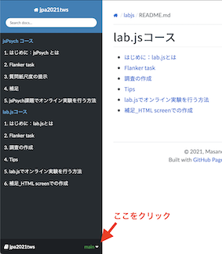

# 日本心理学会第85回大会TWS「はじめてのオンライン心理学実験・調査：jsPsychとlab.jsを用いた作成」サポートサイト

日本心理学会第85回大会TWS「はじめてのオンライン心理学実験・調査：jsPsychとlab.jsを用いた作成」のサポートサイトです。このサイトにTWSに関する情報をまとめていく予定です。TWSの資料，TWS後のサポート情報などを掲載します。

## 開催日時（オンラインLIVE配信）

**2021年9月8日　15:20〜**

＊日本心理学会第85回大会参加者のみが参加可能です。接続先の情報は大会事務局から提供されます。

## 資料
コースごとに資料をまとめてあります。サイドバーからもお選びいただけます。TWS実施前に予習していただくことをおすすめします。

 * [jsPsychコース](./jspsych/README.md)
 * [lab.jsコース](./labjs/README.md)

サンプルコードは本ページの左下の`main`と書かれたボタンを押してクリックして表示される`Download`というボタンから入手できます。

## サポート用Slackチャンネル

TWS開催後の質問受け付けのため，Slackチャンネルを設けました。質問などがある方は以下のURLを介してSlackチャンネルにご登録していただき，以下のルールを守った上でご質問ください。

### ルール
* 実名での参加をお願いします
    * 匿名の場合は退会処理をさせていただきます
* 本TWSに関する質問に限定してください
    * 本TWS以外の内容はコンサルティングとしてご相談ください
* 場合によっては回答までお時間を頂く場合があります
* できるだけ，参考サイトをご参照いただいた上でご質問ください

### Slackへの参加

以下のリンクをクリックするとご参加いただけます。

[TWSサポートチャンネルへ参加する](https://join.slack.com/t/onlineexptws/shared_invite/zt-uwn4snn7-BNuLtpwBtK8JAq4wV4PCeg)

## 参考情報
### jsPsych
- [jsPsych による心理学実験作成チュートリアルまとめ](https://qiita.com/snishym/items/1e0511f8622282993ed1)
    - 最新の jsPsych に対応していない部分があるので注意
- [jsPsych のための javascript のキほん](https://zenn.dev/snishiyama/articles/99159c79dd02e824c148)
- [高橋先生の「キソジオンライン」](https://github.com/kohske/KisojiOnline)
- [国里の「jsPsych を用いた認知課題の作成」](https://kunisatolab.github.io/main/code_tips.html)
- [小林の「jsPsych チュートリアル」](https://www.notion.so/jsPsych-73cade0a2e044217aedf01b5845e8d4e)

### lab.js
*  [lab.jsチュートリアル](https://labjs.yucis.net/)
* [大杉尚之・小林正法（2020). GUI ベースの web 実験作成ツール(lab.js)の紹介と実践, PsyArxiv](https://psyarxiv.com/ym5sb/)
* [小林正法 (2021). 再生テストに基づく記憶現象のオンライン実験による再現 心理学研究](https://www.jstage.jst.go.jp/article/jjpsy/advpub/0/advpub_92.20213/_article/-char/ja/)
* [小林正法・大杉尚之 (2021). オンライン実験・調査への参加・作成を介した心理教育　映像情報メディア学会誌](https://www.ite.or.jp/content/journal/)
* 小林正法 (印刷中). lab.js BuilderによるGUIベースのオンライン心理学実験の作成　基礎心理学研究（情報掲載のみ）
* 大杉尚之 (印刷中). 心理学系学部の大学生のための lab.js による 実験プログラミング学習環境の構築　基礎心理学研究（情報掲載のみ）

## 実習のオンライン化・オープンデータ化
実習のオンライン化・オープンデータ化に関心のある方は以下のフォームからメールアドレスをご登録ください。

<iframe src="https://docs.google.com/forms/d/e/1FAIpQLSd9Y3N-9a3cfe6hS0N2FJkN04K48uOyNQiwPnAm2_hm4qpbqw/viewform?embedded=true" width="640" height="536" frameborder="0" marginheight="0" marginwidth="0">読み込んでいます…</iframe>

## 企画者・講演者（順不同）
 * 小林正法（山形大学）[HP](https://mklab.info/)
 * 国里愛彦（専修大学）[HP](https://kunisatolab.github.io/main/index.html)
 * 大杉尚之（山形大学）[HP](http://tosugi2010.sakura.ne.jp/index.html)
 * 西山慧（日本学術振興会・京都大学）
 * 紀ノ定保礼（静岡理工科大学）[HP](https://sites.google.com/site/yasknsd/)
 * 遠山朝子（専修大学・日本学術振興会）
