# jsPsych課題でオンライン実験を行う方法

jsPsychを使ってオンライン実験をする場合は，サーバーを借りて実行・データ保存するホスティングが必要になります。以下を参考に，ご自身の目的にあった方法を選択ください。

- [JATOS(レンタルサーバー代，最初の設定をすれば使い易い)](https://kunisatolab.github.io/main/how-to-jspsych-jatos.html)
- [Pavlovia(有料，設定簡単)](https://kunisatolab.github.io/main/how-to-jspsych-pavlovia.html)
- [Firebase　(大規模でなければ無料，Firebaseの知識が必要)](https://kunisatolab.github.io/main/how-to-jspsych-firebase.html)
- [Google Spreadsheet (大規模でなければ無料，GASの知識が必要)](https://kunisatolab.github.io/main/how-to-jspsych-google-sheet.html)

# GitHub Pagesを使ってjsPsych課題をオンライン公開する方法

短時間出来る方法として，以下では，GitHub Pagesを使ってjsPsych課題をオンライン公開する方法について説明します。

- まず，GitHubアカウントをお持ちじゃない方は，[GitHub](https://github.com/)にてアカウントを作成してください。
- GitHubアカウントを作成したら，右上の＋の横の下矢印を押して，「Import repository」をクリックします。

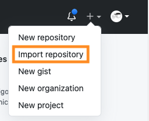

- 以下のようなページがでてきたら，　https://github.com/ykunisato/template-jsPsych-task　をコピーして，オレンジの枠内にペーストします。そして，青の枠内好きなリポジトリ名をつけて，「Begin import」をクリックします。これで，国里のリポジトリにあるjsPsychの基本的な設定がなされたリポジトリがインポートされます。

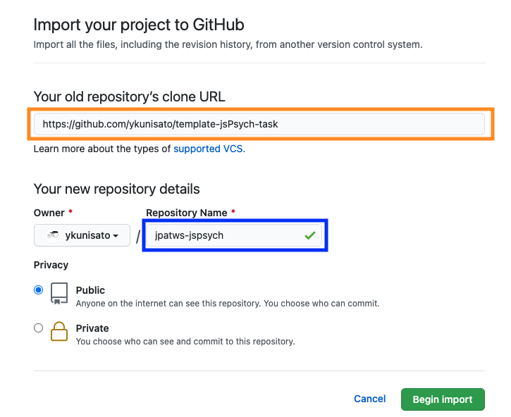

- 以下のようになったらインポート完了です。

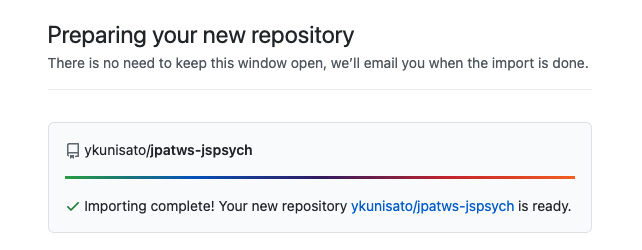

- インポートするとリポジトリは以下のようになります。

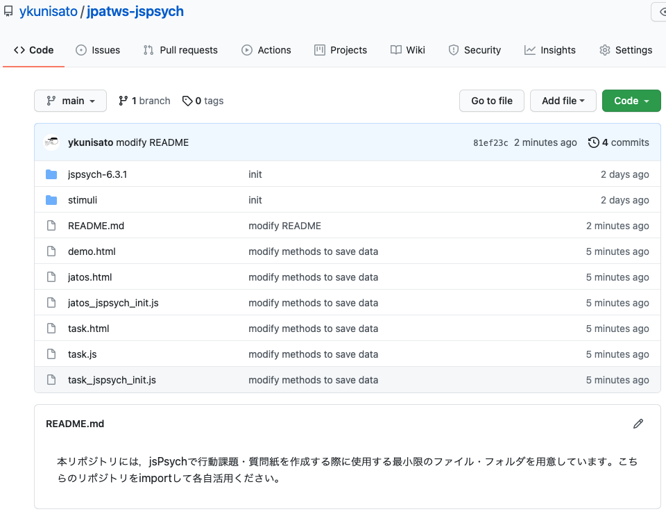

- このリポジトリのブラウザ画面上で，ピリオド(.)をタイプするか，URLのgithub.comをgithub.devに変更します。すると，ブラウザ上で以下のようなVisual Studio Codeの編集画面になります。これがなかなか便利で，コードの編集がブラウザ上でも実行できます。

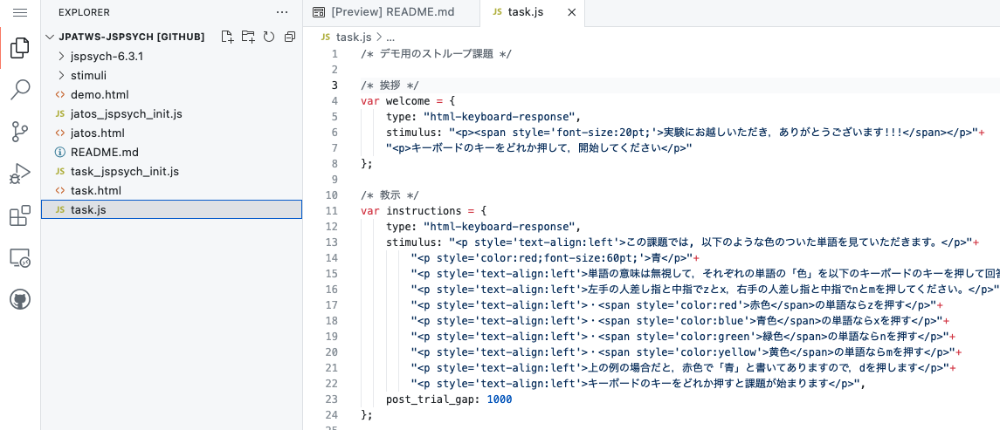

- このリポジトリではHTMLとjsを分けているので，TWSで作成したjavascriptのコードをtask.jsに上書き保存をしてください（インポートしたリポジトリのjsファイルにはストループ課題がはいっていたので，TWSのフランカー課題を上書きします）。変更を加えると，オレンジで囲った部分のように，変更したファイルがあることが表示されます。

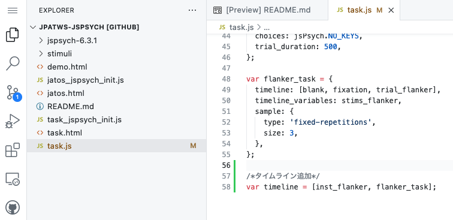

- GitHubは，Gitというバージョン管理ソフトを使ったリポジトリです。ファイルに変更を加えた場合に，メッセージを加えたコミットをします。まず，オレンジで囲われた部分をクリックすると，上に何か入力欄がでてきます。この青で囲われた入力欄に変更についてのメッセージをいれます（日本語でも問題ありません）。そして，上の赤で囲われたチェックボックスをクリックします。これで，変更がメッセージを含めて保存され，リポジトリが更新されました。

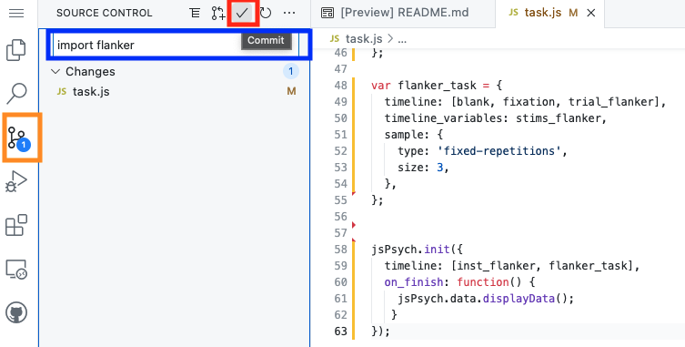

- リポジトリが更新されたか確認するために，リポジトリに戻ります。左上の角をクリックして，「Go to Repository」をクリックします。

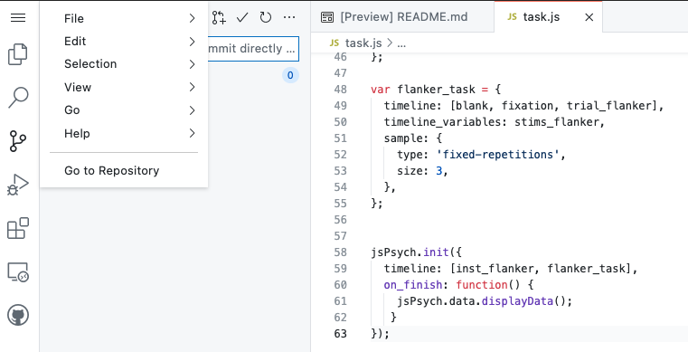

- リポジトリに戻って，task.jsが変更されているか確認します。変更されています。

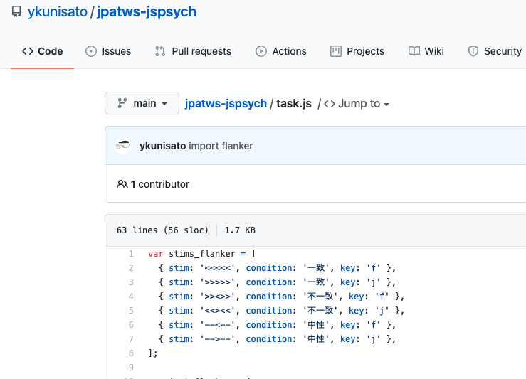

- それでは，作った課題をGitHub Pagesで公開してみましょう。「Settings」をクリックして，左下の「Pages」をクリックしてください。GitHub Pagesというページが開きます。

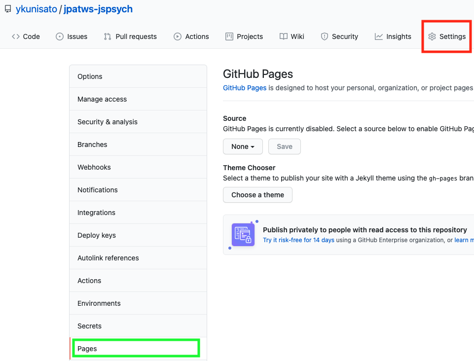

- Sourceのところで，main, /rootを選んで，Saveをクリックします。

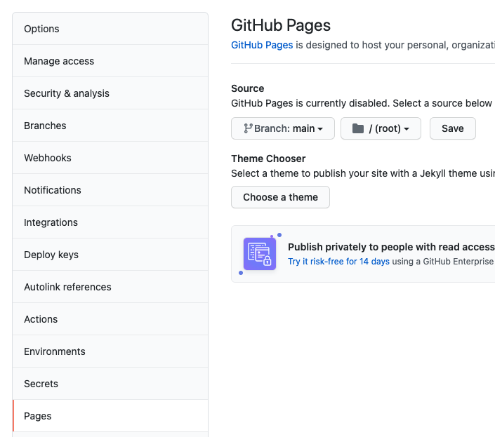

- 以下のようにURLが出てきたら，成功です。URLをコピーします。

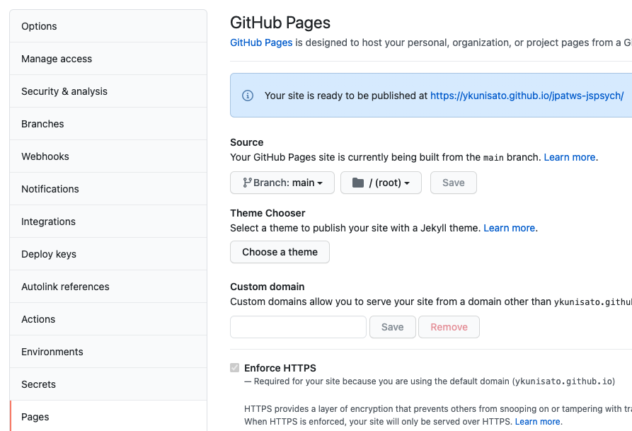

- 上でコピーしたURLに”task.html”を追加すると，以下のようにオンライン上で課題を実施できます。

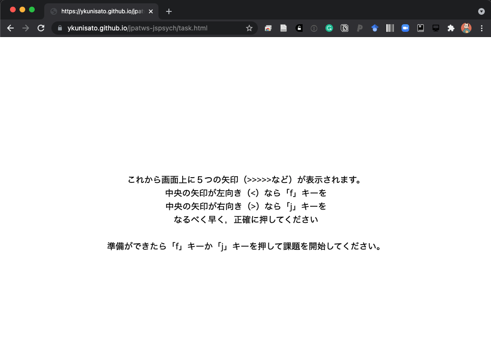

## GitHub Pagesで公開したオンライン課題のデータの保存

 GitHub Pagesでは，データを保存できないので，実際にウェブ実験をする場合は，サーバーを借りたりする必要があります。ただ，GitHub PagesからデータをDropboxに保存させる方法もあります。若干リスクのある方法ですので，[Saving jsPsych data to your Dropbox folder](https://kywch.github.io/jsPsych-in-Qualtrics/save-dropbox/)を読んだ上で利用ください。