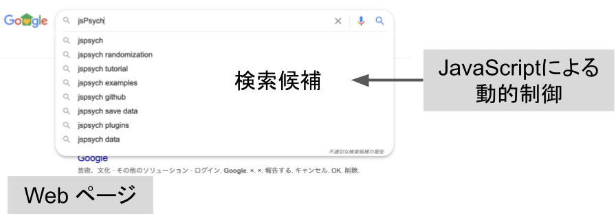

# 1. はじめに：jsPsych とは

## jsPsych の超基本

jsPsych は，心理学実験作成・実施のための JavaScript ライブラリです。
刺激の提示・データ収集の機能がまとめられています。
例えば，以下のような機能が用意されています。

- 単語提示
- 画像提示
- 音声提示
- 選択ボタン提示
- 回答用テキストボックスの表示

### JavaScript とは

jsPsych のベースとなっている JavaScript は，Web ページを動的に制御するためのプログラミング言語です。
映画のサイトで背景画像が切り替わったり，検索窓に文字を入力すると候補が表示されたりするのは JavaScript によって実現されています。

### jsPsych を用いた心理学実験とは

jsPsych を用いた心理学実験は，jsPsych（を含む JavaScript）が埋め込まれた**Web ページ**です。
Google 検索で入力された文字に応じて候補が表示されるように，jsPsych が埋め込まれた Web ページでは時間経過やキー入力に応じて表示内容が更新されることで心理学実験が実現されます。

Web ページなので Chrome や Firefox，Safari といったウェブブラウザで表示されます。
ネット上に公開して URL を共有すれば，世界中の誰でもその人の PC から参加可能になるため，jsPsych を用いてオンライン実験が実施できるわけです。
とはいえ，誰にも URL を共有せず実験室でだけ利用すれば，実験室実験も可能です。
