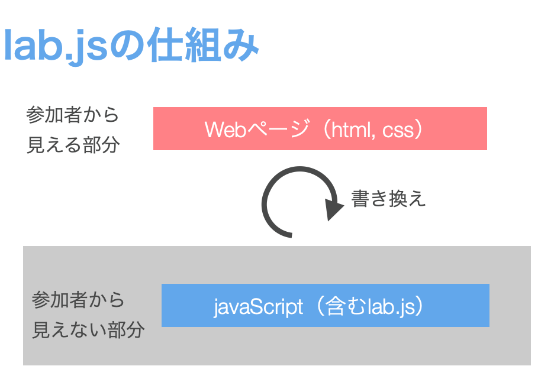

# はじめに：lab.jsとは
小林正法

## lab.jsとは

lab.jsは心理学実験・調査を実施するためのJavaScriptライブラリです。JavaScriptライブラリとはJavaScriptというプログラミング言語において利用できる様々な関数の集合です。lab.jsを利用することで，心理学実験・調査に必要な画面設計や時間制御，反応取得を（比較的）簡単に行うことができます。

### lab.js Builderとは

lab.jsはJavaScriptライブラリであるため，lab.jsによる実験・調査の作成にはコードを書くこと（プログラミング）が必要です。しかし，lab.jsをGUI（Graphical User Interface; グラフィカルユーザーインターフェース）で作成するウェブアプリケーションとして，lab.js Builderが提供されています。GUIとは，名の通りに視覚的に情報が表示され，マウスなどによって直感的に操作可能なインターフェースです。lab.js BuilderはPsychoPyでのBuilderと同様のものです。lab.js Builderを利用することで視覚的に情報を確認しながら，マウス操作などでlab.jsによる実験・調査を作成することができます。

ウェブアプリケーションとは，インターネットブラウザ（Edge, Chrome, Safariなど）で利用できるアプリケーションを指します。ウェブアプリケーションは，コンピュータにソフトウェアをインストールすることなく，ブラウザで利用できるため，異なる環境や機器でも同じように利用できます。


### lab.jsの仕組み

lab.jsはJavaScriptライブラリなので，JavaScriptの機能によって実験・調査を実施しています。JavaScriptの働きの1つにHTMLやCSSを書き換えるというものがあり，これを利用しています。HTMLやCSSというのは，ウェブページの内容や見た目を制御する言語(マークアップ言語)です。皆さんが普段閲覧しているウェブページの多くはHTMLやCSSによって構築されています。この関係をまとめたものが以下の図です。

   


JavaScript（含むlab.js）によって，ウェブページを動的に書き換えることで実験・調査を実施します。それぞれの言語の役割は以下のようになっています。

- HTML：ウェブページの内容，レイアウト，見た目を制御
- CSS：ウェブページのレイアウトや見た目をHTMLよりも細かく制御
- JavaScript（lab.js）：HTMLやCSSを制御（書き換える）

例えば，「画面中央に文字を出して，10秒経ったら消える」という動作を行う場合は以下の流れで実現しています。

1. 中央に文字（'Hello, world!'）を配置したウェブページ（HTML, CSS）を作成
2. 1.のページの表示開始時点からの経過時間を計測（JavaScript）
3. 経過時間が10秒に達したら，ウェブページを書き換え，中央の文字を消す（JavaScript）


## はじめてのlab.js Builder

### lab.js Builderの利用方法

lab.js Buliderは以下のURLをクリックしてください。

[lab.js - online research made easy](https://lab.js.org/)

このページは今後も使うのでブックマークしておきましょう。次にlab.js Buliderを起動します。↑のページの右上のあるメニューから「Builder」をクリックしてください。


### lab.js Builderの初期画面

lab.js Builderが立ち上がると，真ん中の「Welcome」メッセージが表示されています。ここから，公式のチュートリアルや実験例にアクセスすることもできます（チュートリアルは英語の動画ですが，一部，英語字幕を表示できます）。

左のサイドバーに注目してください。このサイドバーが重要です。このサイドバーにある各ボタンによって，調査・実験開始，調査・実験の保存，過去の保存したファイルの読み込み，実施のためのエクスポート，詳細設定，コンポーネントの追加を行えます。以下の図を参考にしてください。

   

「コンポーネントの追加」を赤色で強調していますが，この「＋」ボタンでコンポーネント（調査・実験の要素・パーツ）を追加し，構成していくことで実験・調査を作成していきます。

### どのようなコンポーネントがあるのか

大きく分けてコンポーネントには画面構成用コンポーネントと工程構成用コンポーネントの2種類存在します。

 1. 画面構成用コンポーネント（Canvas ScreenやHTML pageなど）
 2. 工程構成用コンポーネント（LoopやSequenceなど）

画面構成用コンポーネントで実験・調査の画面を作成し，それらのコンポーネントの実施順やループを工程構成用コンポーネントで制御することで実験・調査を構成します。

よく使うコンポーネントの特徴は以下の通りです。

- Canvas Screen：Canvasを用いて画面を構成（時間精度が高い）
- HTML Page：HTMLを用いて質問項目などの画面を構成
- Sequence：複数のコンポーネントをまとめて1つのグループにする
- Loop：含まれたコンポーネントを繰り返す

lab.jsではCanvasベースの画面構成とHTMLベースの画面構成という2種類の画面構成方法が利用できます。それぞれの特徴を理解して，いずれかを選ぶ必要があります。

#### Canvasベースのコンポーネントの特徴
 CanvasはHTML5から追加された技術仕様で（主に）JavaScriptを用いて図形を描画できます。本来はスクリプトで図形を描画するものですが，lab.js BuilderではGUIで図形や画像をCanvasに描画することができます。
 lab.js BuilderではCanvasベースの画面構成用コンポーネントとして，Canvas Screen，Canvas Frameの2つが用意されていますが，基本的にはCanvas Screenを使うことになります。

#### HTMLベースのコンポーネントの特徴
HTMLとは文章を構成するために用いられるマークアップ言語です（厳密は前述のCanvasもHTMLの一部なのですが，lab.js Builderのコンポーネントとしては別の扱いになっています）。lab.js BuilderではHTMLベースの画面構成用コンポーネントとして，HTML Screen, HTML Frame， HTML Page, HTML Formの4種類が用意されていますが，HTML ScreenとHTML Pageを使うことが多いでしょう。HTML Screenは画面をHTMLで記述して構成したい場合に用います。HTML Pageはテキスト入力や多肢選択といった調査に利用できる質問項目がある程度用意されており，調査を作成する際に利用するとよいでしょう。

```tip
#### CanvasとHTMLの使い分けの目安

Canvasは図形の描画用なので文字メインの場合はあまり向いていません（どちらかというと，文字も表示できますが，あえて使う必要はないというイメージでしょうか）。lab.js BuilderでCanvasを利用する場合，描画領域があまり広くありません。HTMLは文字メインの場合やレイアウトをきっちりと定義した場合に向いています。文字メインの実験や調査の場合や文字の表示位置や色を制御したい場合などはHTMLの方がよいでしょう。lab.jsではレイアウト構成用のClassがいくつか用意されており，それらを利用すると文字を水平方向に中央寄せなどを簡単に行うことができます。

一方で，画面描画の時間精度が必要な実験（例えば，注意実験など）は，時間精度に優れたCanvasを利用した方がよいでしょう。lab.jsではCanvasを利用した上で，時間精度を高めるための工夫がいくつか必要になるので留意してください（詳しくは[こちら](https://labjs.yucis.net/99c2d08a0f1d47d1a599e3b93ff9ee1f)）。また，画像や図形を自由に制御したい場合などもCanvasの方が向いています。

具体的には，ストループ課題や視覚探索といった反応時間を従属変数とする課題はCanvasを用いる方がよいでしょう。一方で，調査や場面想定法，単語学習などの反応時間を従属変数としない課題はHTMLを用いる方がよいでしょう。また，あらかじめ用意した画像を呈示するのではなく，プログラムで図形を描画したい場合はCanvasを用いることになります。
```

## プログラムの保存

lab.js Builderには大きく分けて2種類の保存方法があります。1つ目がJSON形式での保存，2つ目がzip形式での保存です（オンライン実験用の保存方法もありますが，ここでは割愛）。それぞれの違いを以下の通りです。

1. JSON形式での保存
プログラム作成途中にプログラムを保存したい場合やプログラム作成後にプログラムを修正できる形で保存したい場合には，こちらで保存する。画像などのプログラムに組み込んだファイルも1つのJSONファイルに自動的に含まれる（カプセル化）。この形式で保存した場合，lab.js Builderで読み込まないと実験・調査としては動作しない。

2. Zip形式での保存（Offline data collection）
実際に実験・調査を行うために保存する。この形式で保存した場合，フォルダに含まれるindex.htmlを開くことで実験・調査を行うことができる。主にオフラインでの実施を想定した保存方法。

1のJSON形式で保存すれば，保存したJSONファイルをlab.js Buliderで読み込むことで，2のZip形式での保存を行うことができます。

### JSON形式での保存（Save）

#### 保存

 * サイドバーの上にあるフロッピーディスクのアイコン💾をクリックしてください。

    *   


 * 「study-yyyy-mm-dd—hh_mm.study.json」という形式のファイルを保存することができます
    * yyyyには作成年，mm-ddには作成月日，hh_mmには作成時間が入ります（例えば，「study-2020-05-08—12_40.study.json」）。
 * このファイルを任意の場所に保存してください。次からは，このファイルをlab.js Builderで読み込めば，ここまでで作成したプログラムを再び開くことができます。

#### 読み込み
　次に保存したJSONファイルを読み込んでみましょう。

* プログラムを新規作成するため，lab.js Builderのサイドバーのフロッピーディスクアイコンの横の▼を押してください。そうすると，以下のメニューが表示されるので，その中から，「New」をクリックしてください。

    *   

 * 「New」をクリックすると，新しいプログラムを作成するかどうかの確認として「Are you sure you want to reset the study?」というアラートが表示されるので，「OK」を選んでください。そうすると，lab.js Buliderがリセットされます。
 * 続いて，先ほど，保存したファイルを読み込んでみましょう。プログラムの新規作成を行った時と同じようにサイドバー上の▼をクリックしてください。その中から，「Open」を選びます。コンピュータ内のファイルを選択するウィンドウが表示されるので，先ほど保存したJSONファイルを選び，開いてください。
 * 先ほど保存したプログラムが再び表示されたはずです。
 * 自身で作成していないlab.js Buliderで作成されたプログラムも，JSON形式で提供されていれば，読み込むことが可能です。

```warning
#### 定期的に保存しよう

lab.js Buliderは，プログラムを保存しなくてもCookieという仕組みでユーザー情報を一時的に保存しているため，lab.js Buliderを再度起動した場合にそれまで開いていたプログラムが表示されます（進行状況が保存される）。しかし，Cookieによる情報保存は一時的なものであるため，過信してはいけません。例えば，Cookieはブラウザ・コンピュータ単位で保存されるため，例えば，自宅のコンピュータで作成途中のまま保存しなかったプログラムは大学のコンピュータでlab.js Buliderにアクセスしても表示されません。作成途中はできるだけ定期的にJSON形式で保存するようにしましょう。
```

### Zip形式での保存（Offline data collection）

　次に，保存したコンピュータでlab.js Buliderで作成したプログラムを実行するための保存方法を紹介します。この方法で保存することで，保存したコンピュータで作成したプログラムを実行できます。今回は，インターネットに繋がっていなくてもプログラムが動く設定（Export for local use）で保存してみましょう。

 * これまでと同様に，フロッピーディスクアイコンの横の▼を選び，「Offline data collection」を選んでください。
 
   

*  そうすると，「study-export.zip」という名前でファイルを保存することができるので，任意の場所に保存してください。
* コンピュータで作成したプログラムを実行する場合には，zipを解凍（すべて展開）した後，フォルダの中にある「index.html」を開いてください。実験室などの対面実験を行う場合にはこの方法で保存しましょう。

## jsPsychとの違い
lab.jsとjsPsychの特徴は以下の通りです。どちらかというとlab.jsはプログラミング未経験者やプログラミング未経験者に実験作成を教える方に向いており，jsPsychはプログラミング経験者やプログラミングを1から身につけようという方に向いていると思います。

 * lab.jsの特徴
   * BuilderによってGUI（グラフィカルユーザーインターフェース）での作成が可能
   * 最小限のコーディング
   * ある程度整ったレイアウト
 * jsPsychの特徴
   * コーディングでの作成
   * プラグインが豊富
   * レイアウトの自由度が高い


```note
#### 複雑な制御にはコーディングが必要
lab.jsはBuilderを使うことで必要最小限のコーディング（例えば，`${parameters.variables}`など）で実験・調査を作成することができます。しかしながら，複雑な制御を行いたい場合にはコーディングが必要となる場合も多いのも事実です。Builderで作成できるものは，あくまでもシンプルな実験・調査だということですね。そう考えると，lab.jsにせよ，jsPsychにせよ，コーディングがいずれかの段階で必要となるという点では，あまり変わらないのかもしれません（そもそも両方ともJavaScriptライブラリなので）。
```