# Flanker task

刺激として今回は `<<<<<`, `>>>>>`, `<<><<`, `>><>>` の４つを使用します。参加者は真ん中の記号が`<`なら`f`キー，`>`なら`j`キーを押すこととします。

チュートリアルを通して，[このような課題](demo/flanker_task_demo)（クリックすると実験が始まるので注意）が完成します。

## 0.空白の画面を呈示する

まずは表示画面の見方から説明していきます。Builderを起動すると，ウィンドウ内が２つのコラムに分割されています。左上には「実験の実行」，「作成したプログラムの保存」，「詳細設定」に関連するボタンが以下のように配置されています。


 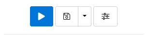


左側のコラムにある「＋」の部分をクリックすることで，刺激画面のパーツを作成することが出来ます。例えば，各試行における「注視点」「刺激画面」「ブランク画面（ISI）」はこのコラムにパーツを追加することで作成していきます。また，「１つの試行としてグループ化する」，「試行を繰り返す」，「教示画面を作る」といった様々なことが，この「＋」をクリックすることで行われます。


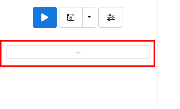


最後は，右側の大きな領域です。ここでは，「刺激をどこに呈示するか？」，「どのような色にするか？」，「何ms呈示するか？」，「反応キーをどうするか？」といった，各画面での設定を行うことができます。


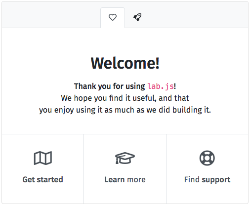


それでは，まず「空白の画面」を作成してみましょう。

 1. 左側のコラムの「＋」を押すと，以下のようにポップアップウィンドウが表示されます。このウィンドウの「Screen Canvas」をクリックしましょう。
    * 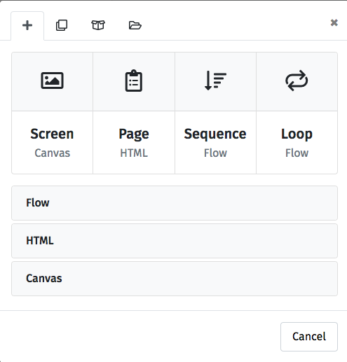

 2. すると以下のように，左側のコラムに「Screen」が追加され，右側の広い領域に「Screen」というタイトルと，空白の「Content」が表示されます。
    * 


これで，「空白の画面を配置する」という作業が出来ました。「lab.js Builder」ではこのように画面を追加することによって実験を作成していきます。

では，このまま実行すると何が起こるのかを見てみましょう。「実験プログラムを実行する」には左上の青色の実行ボタンをクリックします。実行すると，新たに何も表示されていない空白のウィンドウが開き，そのまま停止すると思います。それでは，ウィンドウを閉じてください。

最初のステップはこれで終了です。


## 1. 刺激を１つ呈示する


 1. 左側のコラムのメニューの「＋」をクリックして，新しい「Screen」を作成してください。「Screen」の右上の「Content」をクリックしてください。  
    * 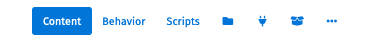

 2. 次に，ページの下側に画面をスクロールさせ，下側のメニューの「+」をクリックし，「Text」をクリックしてください。
    * 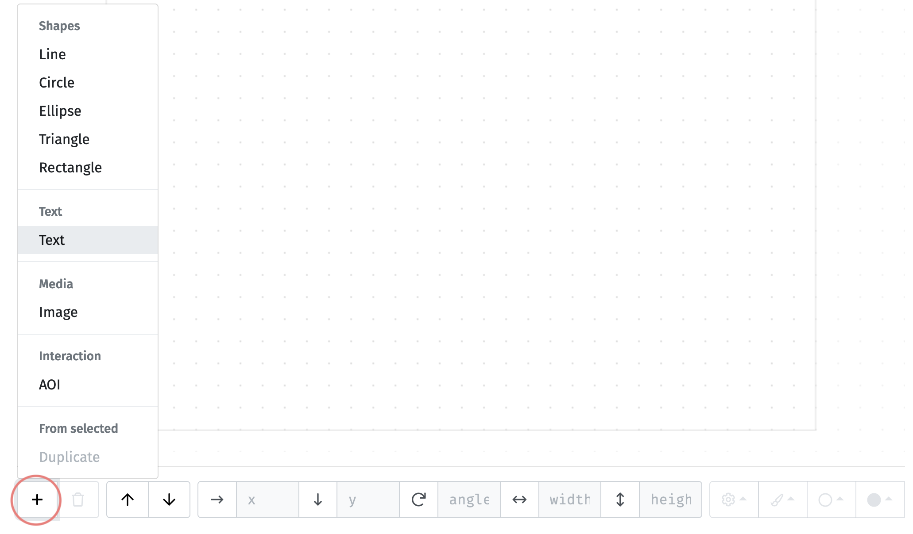

 3. 「text」を追加すると以下のようにCanvasに文字列（text）が入ったテキストボックスが出現します。
    *  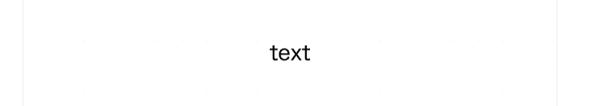

 4. 次にテキストボックスの中身を書き換えていきます。全角入力にして「＜＜＜＜＜」と入力してください。
    * 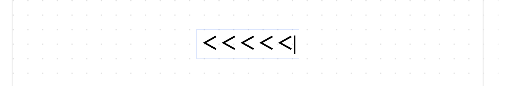

 5. 文字の大きさを「60pt」に変えてください。下側のタブのフォントのメニューをクリックし，「60」と入力してください。
    * 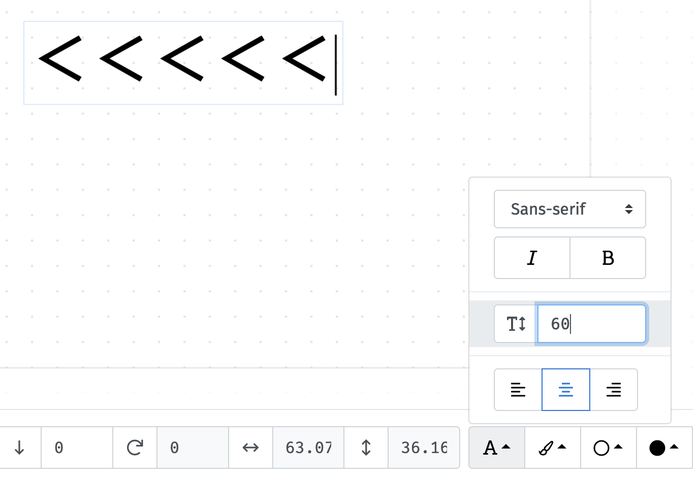


## 2. 複数の画面を作成する

### 2.1.  画面（Screen）の名前を変更する

 1. 右側のページの上側に，画面の名前を入力するボックスがあります。「Screen」から「stimulus」に変更してください（名前は何でも構いません）。
    * 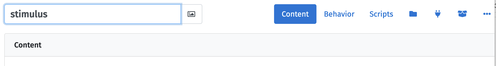


### 2.2. 各試行の流れを作る

実験では，各試行は複数の画面で構成されています。一般的には，次の試行までのインターバル（ブランク画面：post_trial_gap）が含まれています。

 1. 複数の画面を作るためには，左側のコラムの「+」をクリックし，「Screen Canvas」を選択します。すでに刺激画面「stimulus」を作成していますが，その後に画面（Screen）を作りましょう（以下の図を参照）。
    * 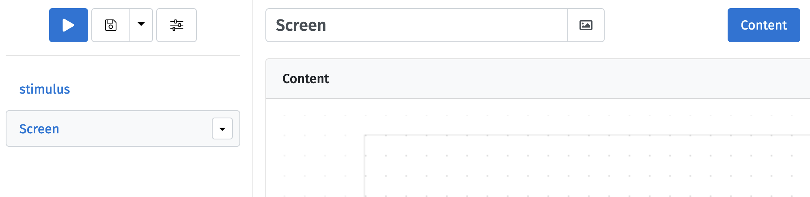

 2. 「Screen」を作成したら，名前を変更します。画面名は「post_trial_gap」にしましょう。左側のコラムで選択し，右側のタイトル部分を変更します。
    * 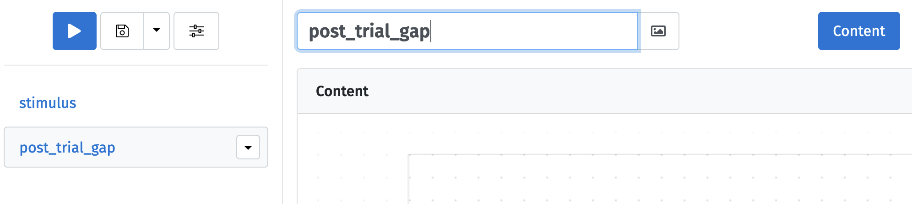


### 2.3. 各画面の呈示時間，反応キーを設定する

#### 刺激画面の設定

刺激画面「stimulus」では，中央の記号が「＜(left)」なら「f」キー，「＞(right)」なら「j」キーを押すようにします。

 1. 上部の「Behavior」を選択します。「Timeout」は入力せず，「Never」のままにしておいてください。
    * 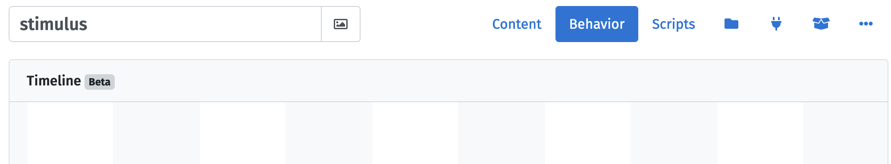

 2. 次に，「Responses」のパラメータを以下のように変更してください。「label」には「left」，「action」には「keypress」，「filter key/button」には「f」を入力します。これでleftに対応したキーを設定することができます。
    * 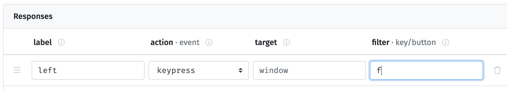

3. 「right」に対応するキー「j」の設定を行います。「left」の行の下の「＋」をクリックすると「行」が下に追加されます。以下のように入力してください。「label」には「right」，「action」には「keypress」，「filter key/button」は「j」を入力します。
    * 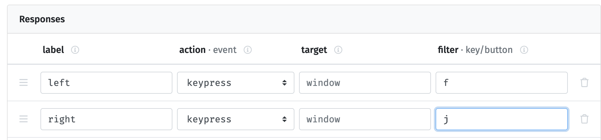

#### ブランク画面の設定

 1. 「post_trial_gap」画面の設定をします。この画面は，0.5秒間(500ms)呈示して切り替わるように設定します。「Timeout」に「500」を入力してください。
  * 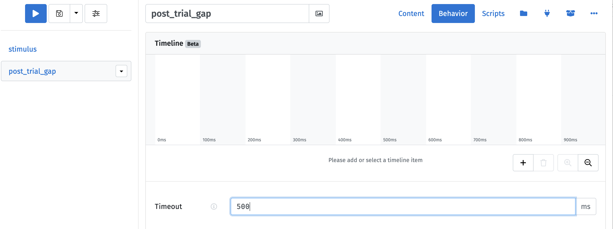

ここまで入力を行い，左上の再生マークを押して実験プログラムを実行すると，「＜＜＜＜＜」が呈示されます。「fキー（left）」か「jキー（right）」を押すと，ブランク画面が呈示されて実験プログラムが終了します。

#### シーケンスの設定

ここまで「stimulus」，「post_trial_gap」の２つの画面を作成してきました。これらを１つにまとめた「シーケンス（Sequence）」を設定します。

 1. まずは左側のコラムの「＋」をクリックして，「Sequence Flow」を選びます。そして名前を「trial」に変更します。
    * 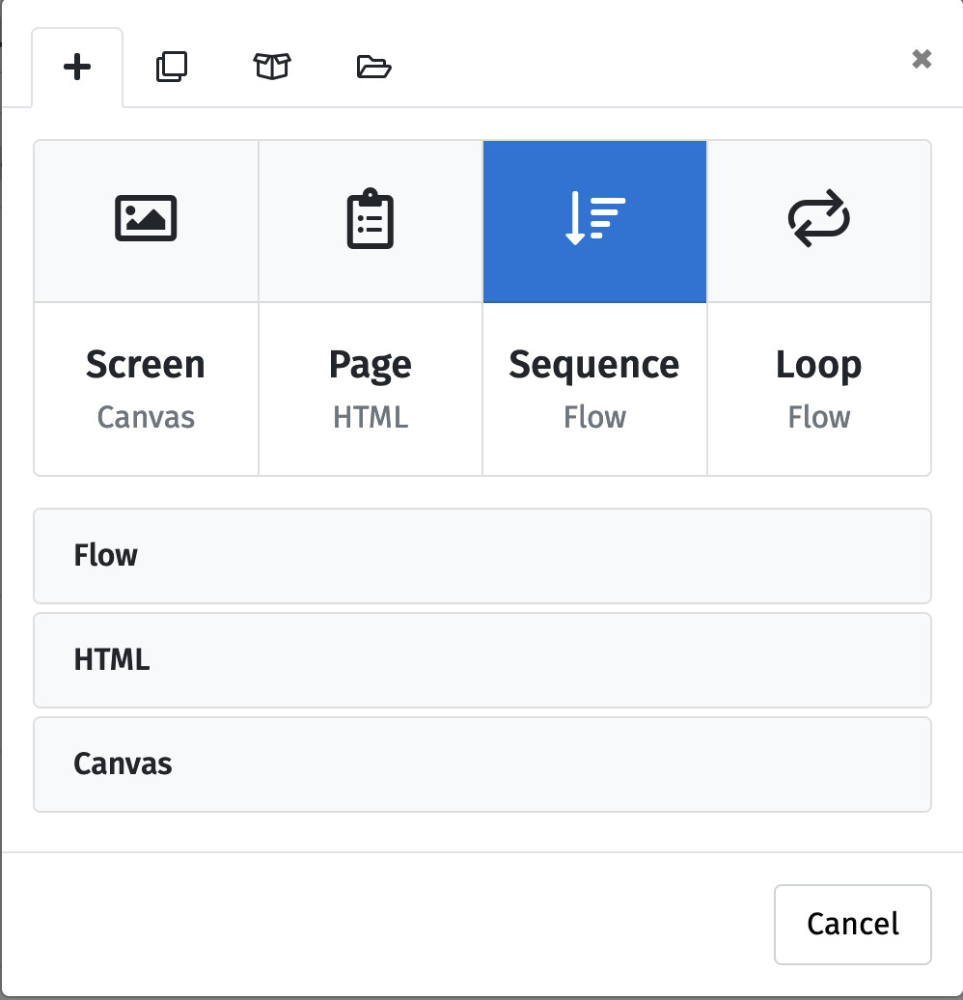

 2. 「stimulus」，「post_trial_gap」をそれぞれ選択して，「trial」の下に出てくる「+」にドラッグします（この「+」は通常のものより右にずれています）。「Trial」よりも少し右にずれて「stimulus」が表示されていれば成功です。同様に「post_trial_gap」も「trial」の下に加えてください。
    * 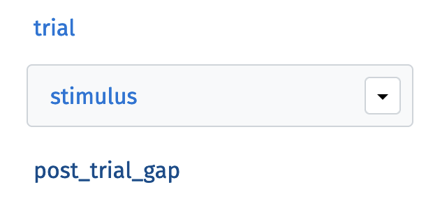

Sequenceは「フォルダ」のようなものです。作成した３つの画面を「trial」の下に加えると１つの試行が完成します。
最終的には以下のようになっていれば完成です。少しわかりにくいですが少し右側にずれています。

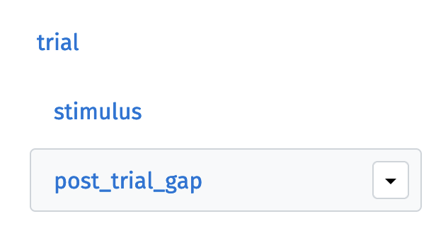

### ここまでのサンプルコード
「0. 空白画面を呈示する」から「2. 複数画面を作成する」までのサンプルコードです（右クリックして保存してください）。

[flanker_1.json](data/flanker_1.json)

## 3. 異なる刺激で複数試行実施する

### 3.1. 複数試行を加える

それぞれの試行で呈示される刺激が変わるようにします。

 1. .まずは，「trial」をコピーして2つのシーケンスを作成します。「trial」の右側の「▼」をクリックし，「Duplicate」をクリックします。（間違えてDeleteしないように注意！）
    * 

 2. 以下のように複製されたかを確認してください
    * 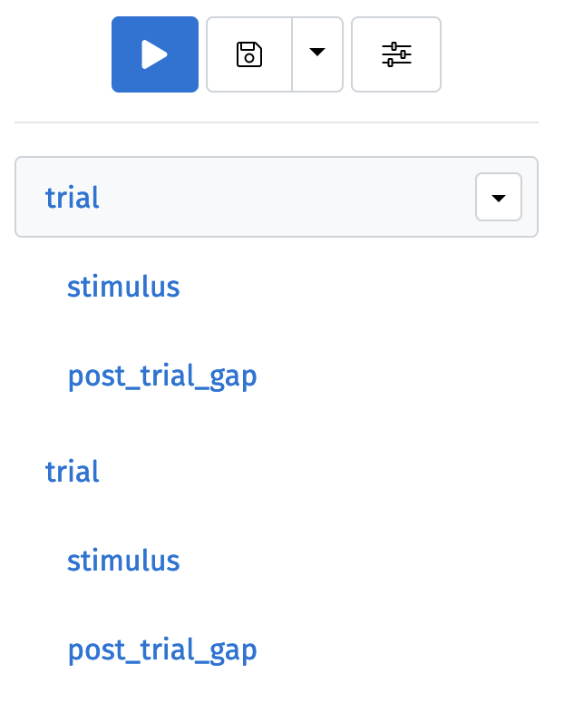

 3. １つ目を「trial1」，２つ目を「trial2」にします。以下のように名前を変更してください。
    * 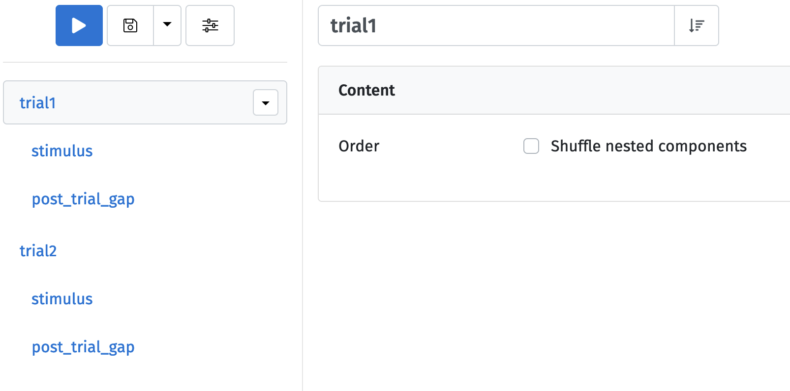

### 3.2. 画面の呈示内容を変える

「trial2」で呈示する刺激を「＞＞＞＞＞」に変えてみましょう。

 1. 「trial2」の「stimulus」画面を選択して，「Content」の内容を「＞＞＞＞＞」に変えましょう。
    * 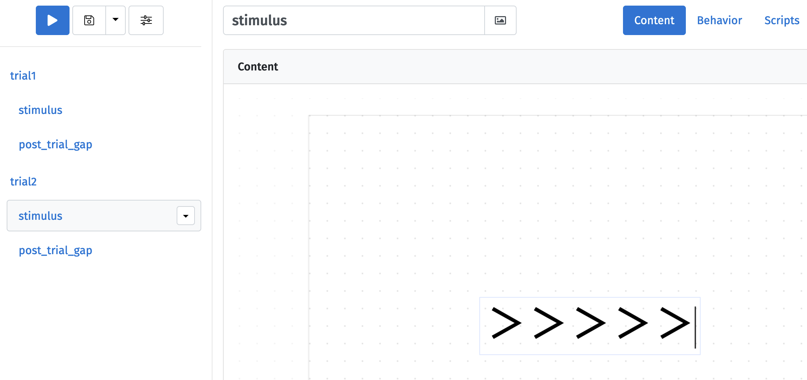

ここまで作成したプログラムを実行してみると２試行分が呈示されます。

### 3.3. ４試行分作成しよう

上記の応用で４試行分を作成しましょう。「stimulus」の内容を以下のようにそれぞれ割り当てて作成してみてください。

- trial1 : ＜＜＜＜＜
- trial2 : ＞＞＞＞＞
- trial3 : ＞＞＜＞＞
- trial4 : ＜＜＞＜＜

以下のように４試行分が作成できます。

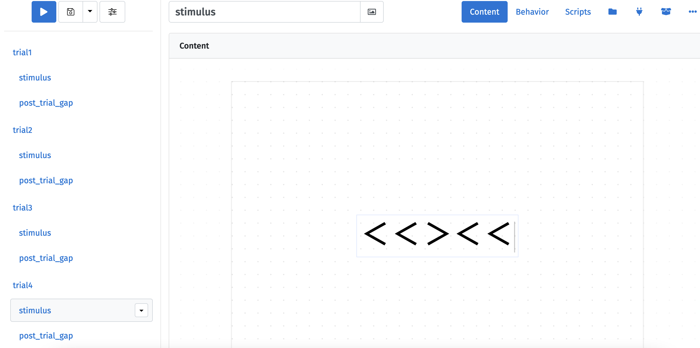


### 3.4. 表示される内容をコンパクトにしよう

４試行分を作成すると，左側のコラムが縦に長くなり，視認性が悪くなってきました。そこで，各シーケンスを短縮表示してみましょう。

 1. 「trial1」の「▼」をクリックし，メニューから「Collapse」を選びます。
    * 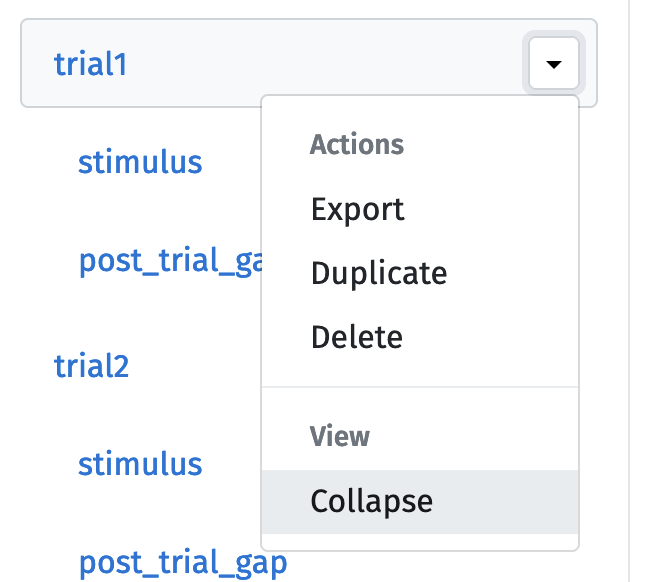

 2. 以下のように表示されたかを確認してください。
    * 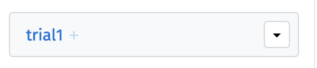
 
 3. 全ての試行をコンパクトにまとめると以下のように表示されます。
    * 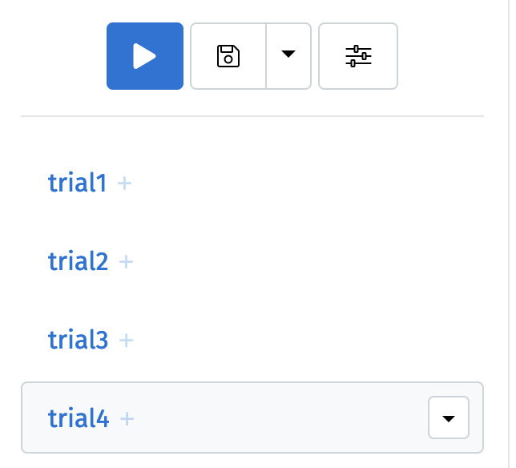

なお，展開する時には，格納の際と同様に「▼」ボタンを押して，「Expand」を選択します。

### 3.5. 4試行の順番をランダムにしよう

次は上記の４試行の順番をランダムにします。

 1. 新たに「Sequence」を作成し，「Block」という名前にします。この「block」以下に「trial1」〜「trial4」までをまとめてしまいましょう。
    * 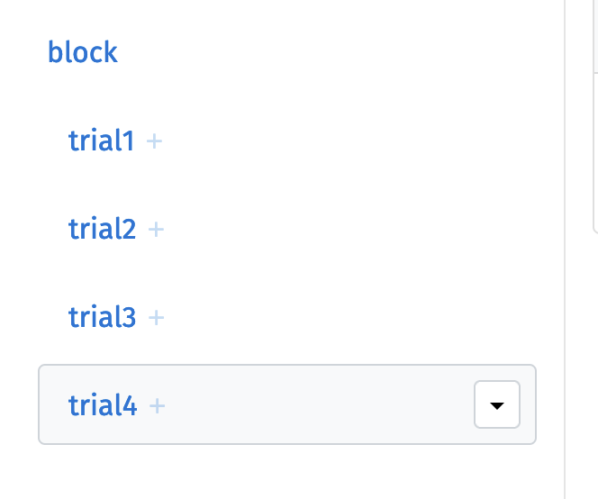

2. 「trial1」〜「trial4」の呈示される順番をランダムにするためには，「block」の「Content」の「Order」の「Shuffle nested components」にチェックを入れます。
    * 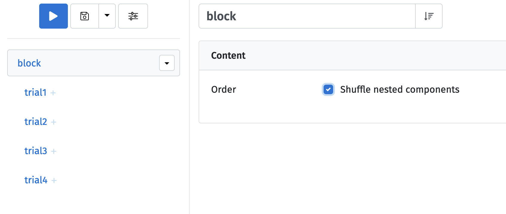

これで「trial1」〜「trial4」までの順番をランダムにすることが出来ました。

### ここまでのサンプルコード
「0. 空白画面を呈示する」から「3. 異なる刺激で複数試行実施する」までのサンプルコードです（右クリックして保存してください）。

[flanker_2.json](data/flanker_2.json)

## 4. Loopを設定する

一つ前のセクションで「Sequence」コンポーネントを用いて複数試行を作成する方法を説明しました。ただ，試行数が４試行程度であればよいですが，例えば100試行分を作成するとなると大変です。

これを回避する方法として「Loop」コンポーネントを設定してみましょう。

### 4.1.「trial」を１つだけ残して削除しよう

 1. まずは，不必要なtrialを削除します。「trial1」を「block」コンポーネントよりも前に移動させます。これで「trial1」は「block」から外れた状態になります。
    * 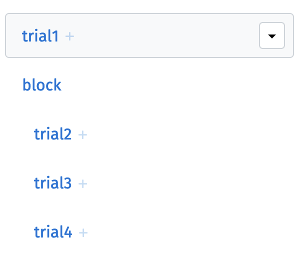

 2. 「block」を選択して「▼」を押し，「Delete」を押してください。
    * 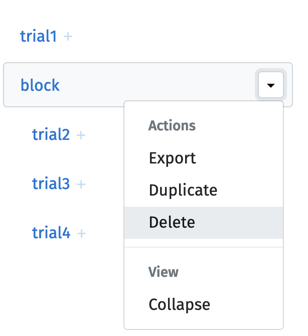

 3. 「trial1」の名前を「trial」にします。
    * 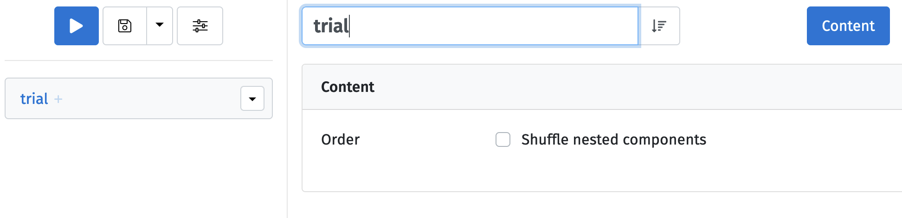

 4. 「trial」の「▼」をクリックして「Expand」を押すと，trialの各画面が表示されます。
    * 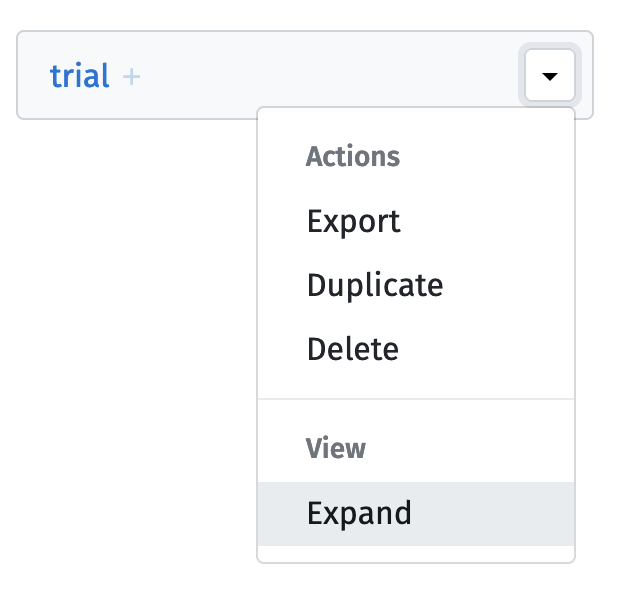

 5. 以下のように表示されます。
    * 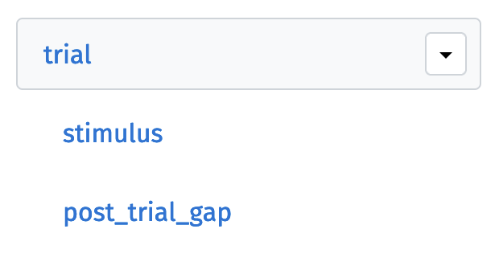

これで，複数の試行を加える前の状態に戻りました。

以下のコードを使用して先に進めていただいてもかまいません（右クリックして保存してから，lab.js Builderで開いてください）。

[flanker_3_1](data/flanker_3_1.json)

### 4.2. ループを作成する

典型的な実験では，１試行で終わることは少なく，数十回，数百回と試行が繰り返されます。このような試行の繰り返しを作るのが「Loop」です。これは，次の章で説明する条件の設定とも密接に関わっています。では，「Loop」を作成していきましょう。

 1. 左側のコラムの「＋」をクリックし，「Loop Flow」を選択し作成してください。 
    * 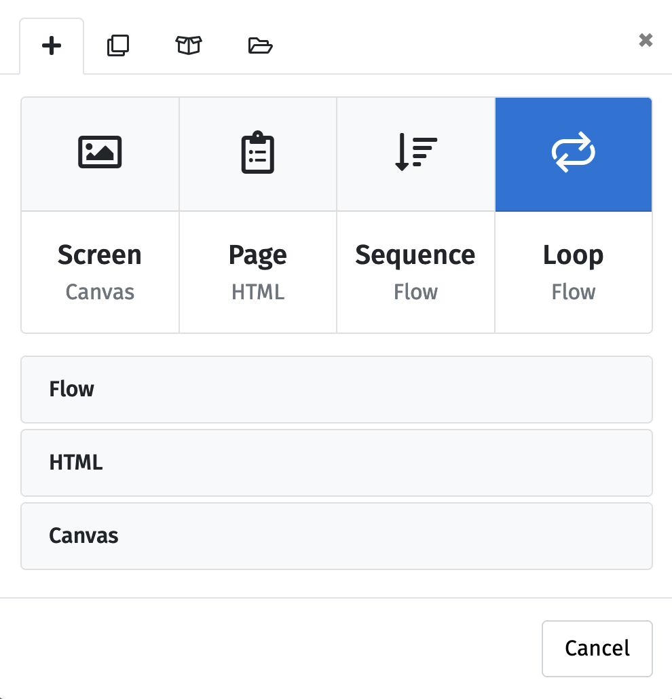
2. 作成したら，ループのタイトルを変えましょう。「stims_flanker」と変えてください。

このタイトルは任意の名前で構いません。例えば，同じ課題を別のブロックに分けて実施する場合には，「Block 1」「Block 2」としても良いかもしれません。また，記憶課題のように学習フェイズとテストフェイズがある場合は「Presentation」と「Test」のように名前をつけても良いと思います。

ループを有効にするためには，先ほど作成したシーケンスをループの中に移動する必要があります。

 3. 「stims_flanker」の下に出てくる「+」に「trial」をドラッグします。以下のように，少しずつ右側にずれていれば正解です。
    * 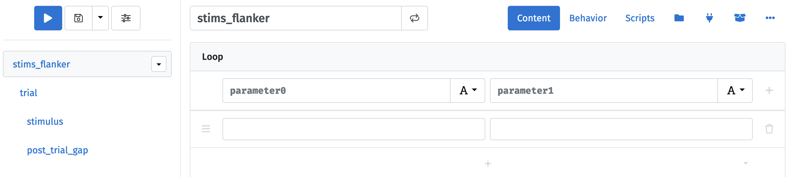

### 4.3.「Loop」の「parameters」を設定する。

名前は，「resp」と「stim」にしましょう。中央の矢印の向きは「resp」で指定し，それに対応する刺激を「stim」で描きます。

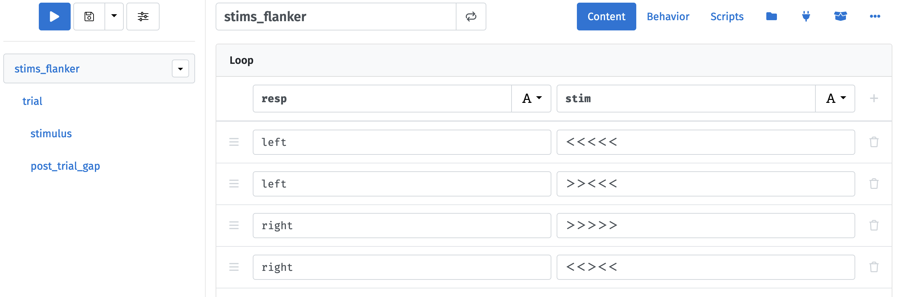

これで，ループ側の設定は終わりです。しかし，このまま実行しても呈示される刺激は変化しません。「stimulus」の画面で設定をする必要があります。

```note
#### Loopにおけるparametersとは何か
Loopではparametersという変数を設定することができます。各parameterにはそれぞれ値（value）を割り当てることができます。Loopコンポーネントは，その中に含まれる（ネストされている）コンポーネントを一定回数繰り返しますが，繰り返しごとにparametersに割り当てた各値を変更して実施されます。変更ルールはいくつか選べますが，デフォルトではすべての値をランダムな順で実施します。このように，Loopコンポーネントを利用することで，一部だけを変更した試行を繰り返すことができます。
```

### 4.4. 刺激パラメータを画面に反映させる

実験で毎試行，色や文字を変えるためには「変数」を指定し，そこの中身を試行ごとに変える必要があります。変数とは「x」や「y」のようなものです。例えば，「x=2」とすれば，xの中身は２になりますが「x=4」とすれば，xの中身は４となります。「lab.js」では変数は「placeholders」と呼ばれています。

lab.jsでは「parameters.XXXX」という書き方の変数を使用します。今回の場合は「parameters.resp」が「反応」に関する変数で，中身（値）は「left」か「right」かのどちらかです。「parameters.stim」が文字に関する変数で，中身は「＜＜＜＜＜」，「＞＞＞＞＞」，「＜＜＞＜＜」，「＞＞＜＞＞」のどれかです。いずれも「Loop」で指定したパラメータがそのまま変数の中身になります。

では，変数の中身（値）を表示するように変更していきましょう。

 1. 左側のコラムから「stimulus」を選び，右側の上側のメニューから「Content」を選びます。テキストボックスを選択し，「Text」を以下のような「parameters.stim」に変えます。
    ```jsx
    ${ parameters.stim }
    ```
    * 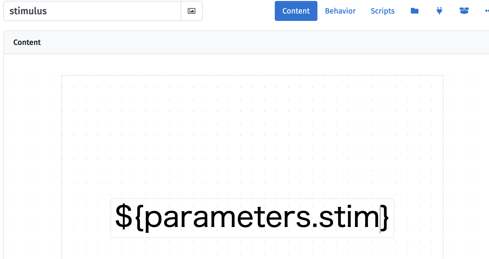

実験プログラムを実行すると，表示される矢印「→→←→→」が試行ごとに変化します。

### 4.5. 刺激のランダマイズについて

lab.js Builderではデフォルトの設定で，条件がランダムに呈示されるようになっています。Sampleの「In random order」の部分です。

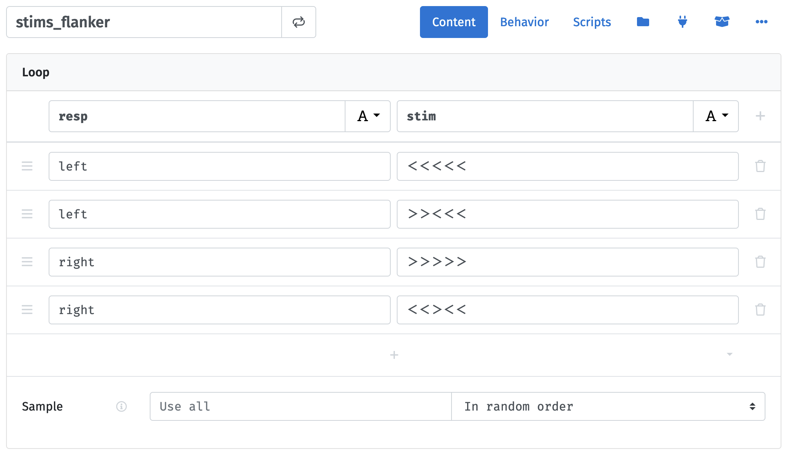

### 4.5. 注視点について

 1. 実験刺激の前に注視点を加えるには「stimulus」の前にScreenを入れてください。名前は「fixation」にしましょう。
    * 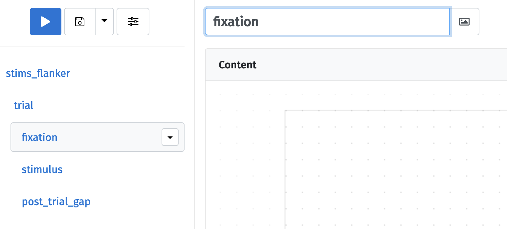
    
2. 次に「fixation」画面に十字を呈示します。下部の「＋」から「Text」を選択し，テキストボックスを書き換えてください（下記の図が紛らわしいですが，テキストボックスを「＋」に書き換えています）。
    * 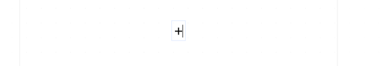

「fixation」ディスプレイでは，キー入力はせず，「500ms」経過したら自動的に次の画面に切り替わるようにしたいと思います。

 3. 「Timeout」に「500」を入力してください。「Responses」はそのままで構いません。これで，「500ms」後に刺激画面に自動的に切り替わります。
    * 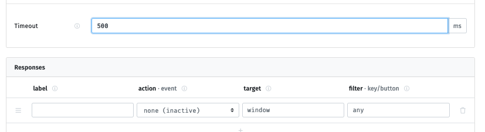

### ここまでのサンプルコード
「0. 空白画面を呈示する」から「4. Loopを設定する」までのサンプルコードは以下です。

[flanker_3_2.json](data/flanker_3_2.json)

## 5. 繰り返し数を設定しよう

刺激の繰り返し数を「10回」にしましょう。

 1. まずは左側のコラムからLoopである「stims_flanker」を選択し，「Content」メニューの下側の領域「Loop」を表示させてください。「▼」をクリックし，「Repeat」の下の「Each row」をクリックしてください。
    * 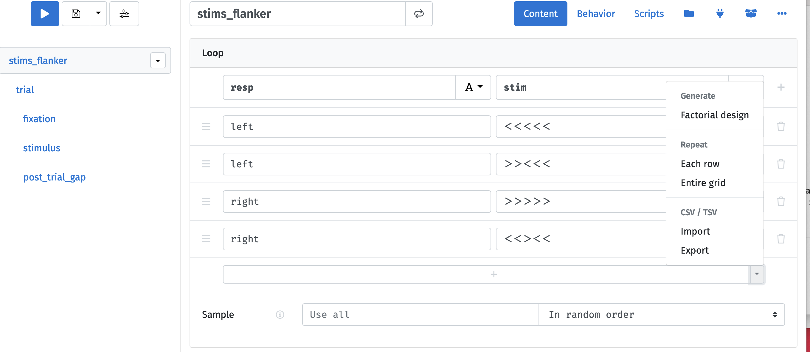
    
2. 以下のようなダイアログが表示されますので，繰り返し数「10」を入力してください。これで４条件×10回の繰り返しで40試行となりました。
    * 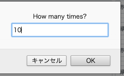

## 6. 実験プログラムを保存する

実験プログラムを保存するためには，左上のメニューの「フロッピー」のアイコン（左から２つ目のアイコン）をクリックします（詳しくは[こちら](./1_about.html#プログラムの保存)）。

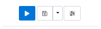

以下のようなダイアログが表示され，「.json」拡張子のファイルを保存することができます。

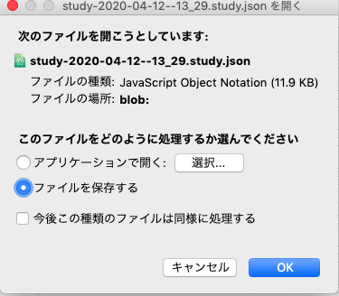

作成した実験ファイルをBuilderに読み込む場合には，「フロッピー」アイコンの横の「▼」をクリックし，メニューの中から「Open」をクリックします。ファイルを指定するダイアログが開くので，保存した「json」ファイルを指定してください。

以上で，フランカー課題の基本的な部分は完成です。

以下はここまでのサンプルコードです（右クリックして保存してください）。

[flanker_4.json](data/flanker_4.json)


## 終わり
これでフランカー課題は完成です。実際にデータを収集する場合にはインフォームドコンセントの取得，教示画面，終了画面などが必要になります。

### 実験のデモ

以下のリンクをクリックすると「フランカー課題」のデモを体験できます。なお，フランカー課題に加えて，[Tips](./4_tips.html#実際の実験に向けた準備)で紹介している教示画面と終了画面とフィードバックを追加してあります。

[フランカー課題デモ](demo/flanker_task_demo)

### 完成版のソースファイル

以下のファイルを右クリックでダウンロードしてください。このファイルをBuilderで読み込めば，完成した状態の実験プログラムを確認することが出来ます。

[flanker_task_demo.json](data/flanker_task_demo.json)


執筆者： 大杉尚之