# 調査の作成
小林正法

## lab.jsで調査を作成

### lab.jsでできること

調査をlab.jsで作成する利点として，以下のような点が挙げられます。

- 尺度単位の実施順のランダマイズ化
- 尺度内の質問項目単位でのランダマイズ化（一部のみ）
- 回答による条件分岐
- 質問紙と実験を統合して実施可能（lab.jsのみで完結）
- 時間制限などの設定が容易
- HTML・CSSでのカスタマイズが可能

### HTML pageを利用した調査の作成

lab.js Builderでは「HTML Page」というコンポーネントを利用することで，様々な質問項目を簡単に作成することができます。フォームにはテキスト入力ボックスや多肢選択ボタンが含まれるので，デモグラフィック情報（年齢や性別）の入力，多肢選択型質問項目，チェックボックス型質問項目，スライダー型質問項目などを利用することができます。詳しい項目の種類は以下をご覧ください。

 * 「HTML Page」で作成できる項目の種類
    * 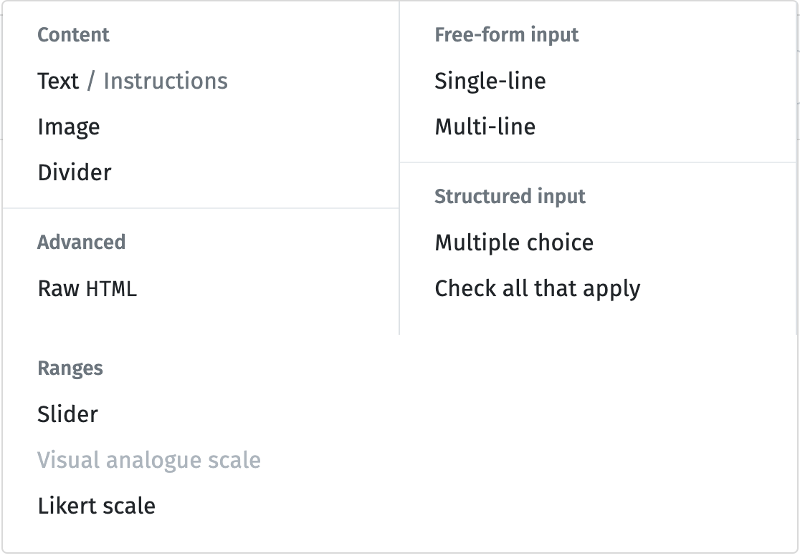

今回は，テキスト入力と多肢選択型質問項目の作成を取り上げます。

## 説明文項目の作成
最初にテキストを表示する項目を作成してみましょう。この項目は教示などに利用できます。

 1. lab.js Buliderを開いてください。開いたら，左のコラムの「＋」から「HTML Page」を選んでください。
    *  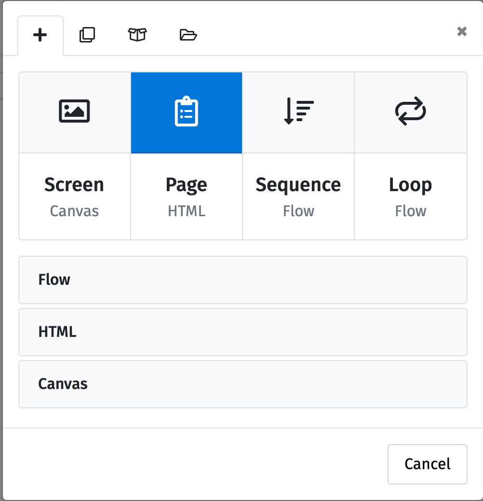
 2. 以下のように「HTML Page」コンポーネントが追加されます。
    * 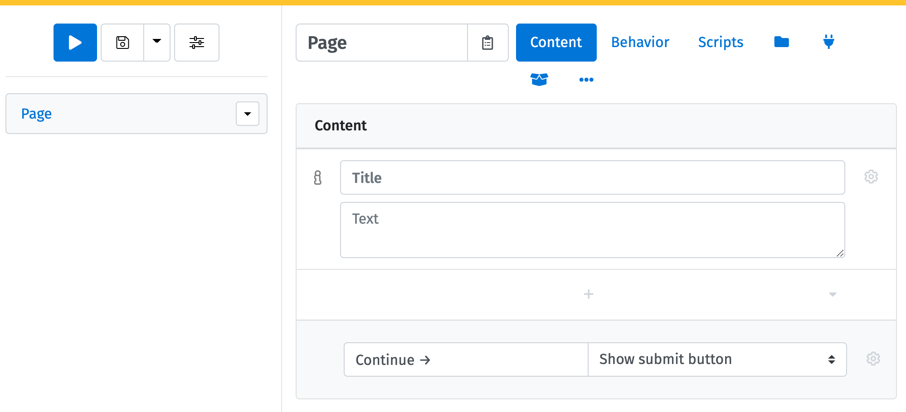
 3. タイトルを「Page」から「Survey」に変更します（名前は任意のものでかまいません）。
    * 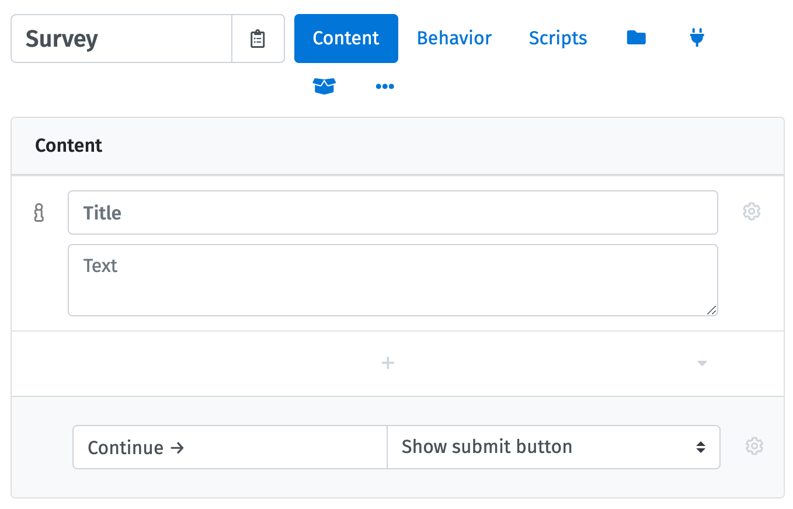
 4. 「HTML Page」ではデフォルトで「Content」内に説明文の1項目が追加されています。ここに説明文を入力しましょう。例えば，以下のような挨拶文を入力してみましょう。
    * Title: 本調査にご参加いただき，ありがとうございます。
    * Text: この調査では，あなたの日常生活や気分についてお聞きします。
    * 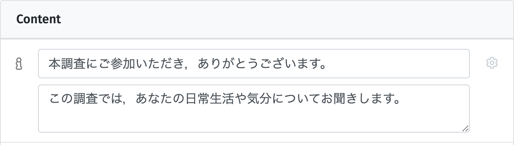
 5. 次のページに移動するボタンを英語から日本語に変更しておきます。「Continue →」を「次へ」に変更してください。
    * 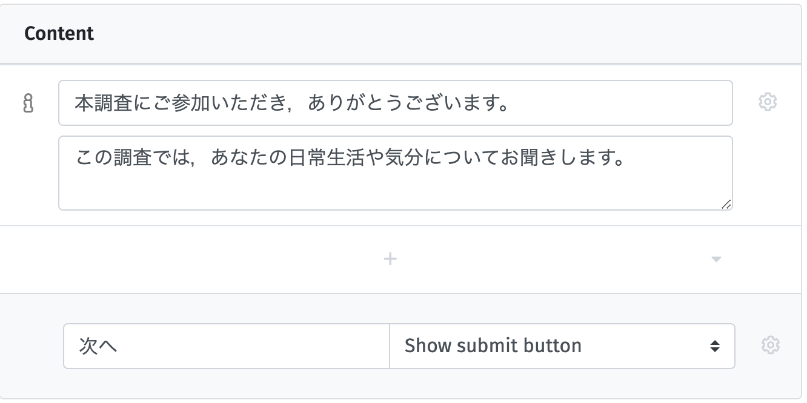

これで説明文を表示するページが作成できました。さらに別の説明文を追加したい場合は，説明文項目の下の「＋」をクリックし，「Text/Instructions」を選ぶと説明文項目が追加できます。

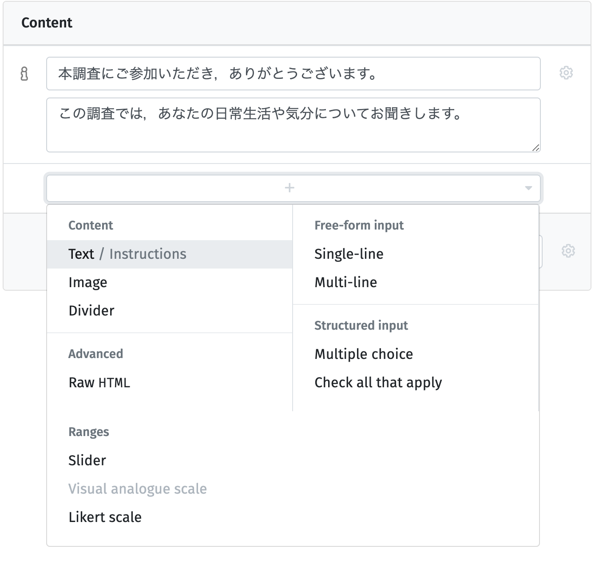

## テキスト入力項目の作成
次にテキスト入力の項目を作成しましょう。テキスト入力項目は性別や年齢の入力や自由記述などに利用できます。ここでは，先ほど作成した説明文項目の下に年齢や性別を入力してもらうテキスト入力項目を追加します。

### 「Single-line」のオプションで変更可能な設定

質問項目の右横の歯車マークをクリックすると，「Single-line」の詳細設定が表示され，以下の点を変更できます。

- Data type
   * 入力内容の種類を指定したい場合に設定します。Textでは特に設定できませんが，Numberにすると数値の範囲や刻みの指定，E-mailにするとメールアドレスかを判定，Dateにすると日付の範囲の指定が可能です。
- Help & Instructions
   * 質問項目に対する補足説明を行いたい場合などに入力します。
- Name
   * データとして記録される質問項目の名前です。
- Validation
   * Require answerにチェックを入れると回答（入力）を必須化できます。

### 作例1. 年齢を問う質問項目の作成

では，年齢を問う質問項目を作ります。以下の手順で行ってみましょう。年齢なので，入力できる値を0〜99までの範囲の数値に限定します。

 1. 説明文項目の下の「＋」をクリックし，「Single-line」を選んでください。
     * 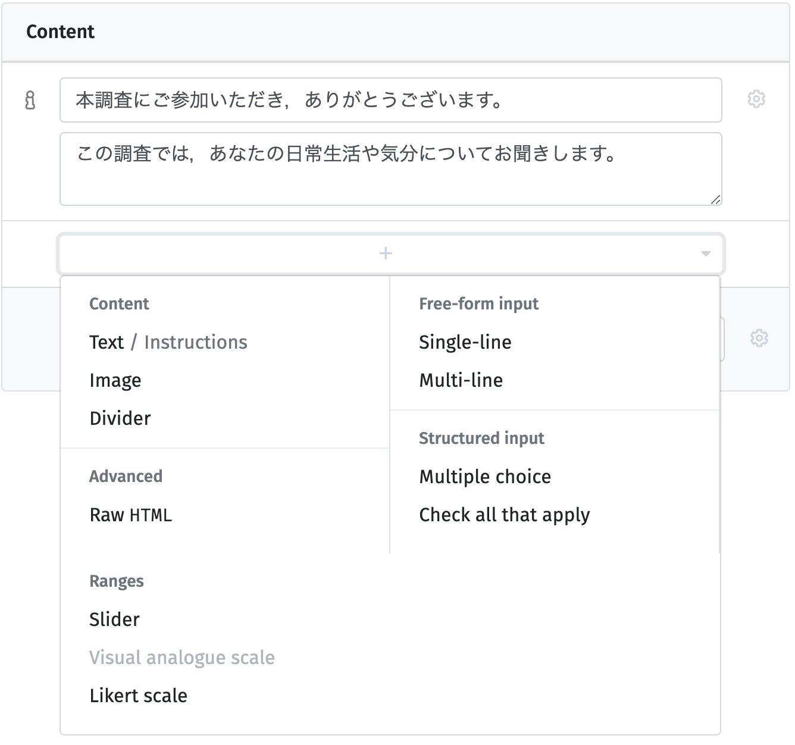
 2. 「Question」に「年齢」と入力
 3. 「Question」の右の歯車マークをクリックし，詳細設定を表示
 4. 「Data type」をNumberに変更
 5. 「Data type」の下にある「↓」（No lower limit）の欄に「18」，「↑」（No upper limit）の欄に「99」と入力し，数値の範囲を指定
 6. Help & further instructionsに「年齢を半角数字で入力してください」と入力
 7. 「Name」に「Age」と入力（エラー防止に半角英数でNameを指定することを推奨）
 8. （回答必須にする場合は）「Validation」にチェック

ここまでで以下の画面のようになります。確認してください。
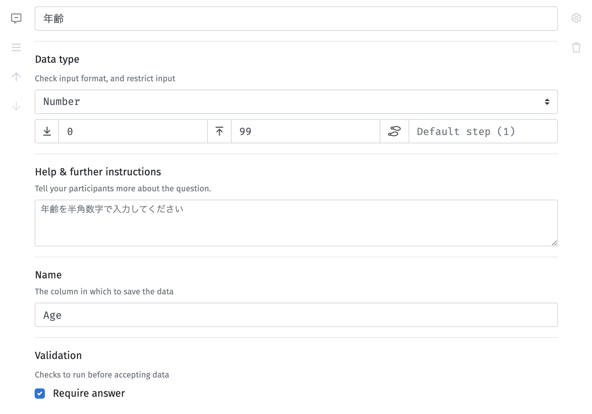

今回は年齢という短い文章の入力だったので「Single-line」を選びましたが，長い文章の入力が必要な場合は「Multi-line」を選びましょう。

### 作例2. 性別を問う質問項目の作成

次に性別を測定する質問項目を作成してみましょう。途中までは年齢の質問項目と同様です。

1. Contentの「＋」から，「Single-line」を追加
2. 「Question」に「性別」と入力
3. 「Question」の右の歯車マークをクリックし，詳細設定を表示
4. Help & further instructionsに「性別を入力してください。」と入力
5. 「Name」に「Sex」と入力（プログラムエラー防止に半角英数でNameを指定することを推奨）

ここまでで以下の画面のようになります。確認してください。
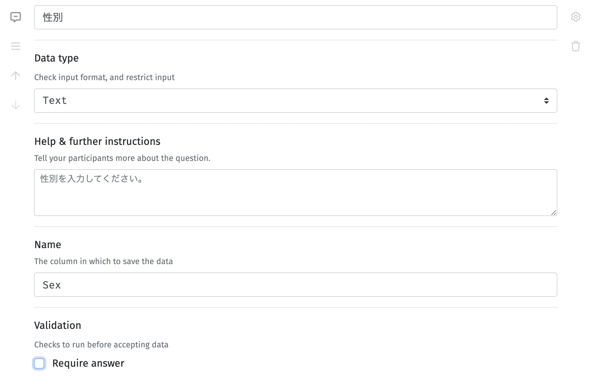

```note
#### 性別入力について
ここでは，性の多様性に配慮するため，性別の入力欄はテキスト入力にし，回答を必須にしていません。もし，多肢選択型項目を利用する場合には「男性」，「女性」だけでなく，「その他」や「回答したくない」などの選択肢を用意するとよいでしょう。
```

## 多肢選択項目（multiple choice）

　多肢選択は質問項目を呈示し，いくつかの選択肢の中から1つを回答として選択してもらうという形式です。

### 「multiple choice」のオプションで変更可能な設定
- Displayの中の Shuffle items
   * チェックすると，選択肢の順番をランダム化（質問項目ではないので注意）
- Help & Instructions
   * 質問項目に対する補足説明を行いたい場合などに入力します。
- Name
   * データとして記録される質問項目の名前です。デフォルトは質問項目からNameを生成してくれますが，2バイト文字だけだとエラーになるので，できるだけ，半角英数でNameを入力しておきましょう。
- Validation
   * Require answerにチェックを入れると回答（入力）を必須化できます。
   
### 作例. BIS/BAS尺度
ここでは，[日本語版BIS/BAS尺度（高橋他，2006）](https://www.jstage.jst.go.jp/article/personality/15/3/15_3_276/_article/-char/ja/)を作成してみます。先ほどのデモグラフィック変数の測定とは別のページにします。

 1. 左コラムの「＋」から「HTML Page」を追加
 2. 「Page」の名前を「BIS_BAS」に変更（名前は何でもOK）
 3. 「Content」にすでに教示用のテキストを打ち込む画面が表示されているので，Textに以下のような教示文を記入（Titleは空欄のままでOK）
   - 「以下の質問文を読んでいただき，あなたにもっとも当てはまると思う選択肢を選んで回答してください。回答は選択肢のボタンを選択することで行ってください。」
 4. 次にContent内の「＋」（Continue→の上）をクリックし，「Multiple choice」を選ぶ
   * 
 5. 追加されたMultiple choiceの「Question」に日本語版BIS/BAS尺度の1項目目「たとえ何かよくないことが私の身に起ころうとしていても，怖くなったり神経質になったりすることはほとんどない」を入力
（質問文に1バイト文字が含まれてない場合はNameを設定しないとエラーが生じます; 詳しくは下記のボックス参照）
 6. 各labelには選択肢を入れますが，この尺度は4件法なので以下のように設定しましょう。各選択肢（label）を選んだ時，codingに入力された値がデータとして保存されます。
   * label「あてはまらない」，coding「1」
   * label「どちらかと言えばあてはまらない」，coding「2」
   * label「どちらかと言えばあてはまる」，coding「3」
   * label「あてまはる」，coding「4」
   * 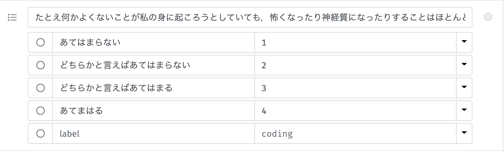
 7.  歯車マークを押して，詳細設定を開き，「Name」に尺度名＋項目番号となる「BIS_BAS_1」と入力してください（**Nameへの入力しないと動作に問題が起きるので注意**）
   * 1項目目なので，「BIS_BAS_1」ですが，2項目目以降は「BIS_BAS_2」などとしてください
 8. 「Validation」を「Require answer」に設定（デフォルトでチェックあり）
 9. これで以下のように1項目目が完成です
   * 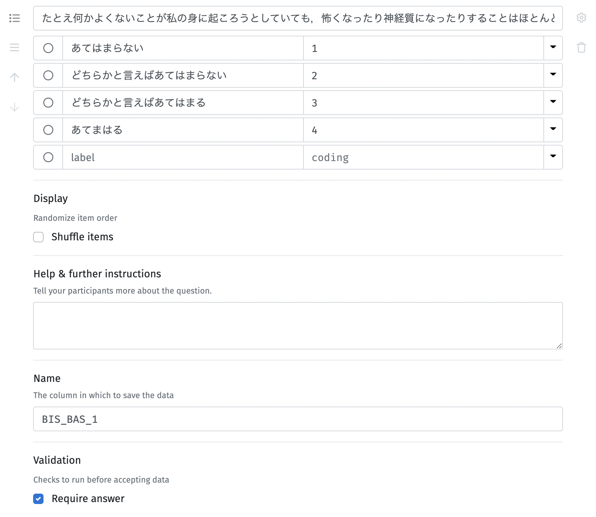
 10. 同じようにすべての項目を作成してください
 11. すべての項目を作成したら，「Continue→」を「次へ」に変更にしたら，完成です

なお，ここでは，質問項目の順番はそのまま入力していますが，実際に調査を行う場合には質問項目の順番をランダムにしましょう。

### 日本語版BIS/BAS尺度の項目一覧
 1. たとえ何かよくないことが私の身に起ころうとしていても，怖くなったり神経質になったりすることはほとんどない
 1. 私は，欲しいものを手に入れるためには格別に努力する
 1. 何かがうまくいっているときは，それを続けることがとても楽しいと思う
 1. 面白そうだと思えば，私はいつも何か新しいものを試したいと考えている
 1. 私は，欲しいものを手に入れたとき，興奮し，活気づけられる
 1. 非難されたり怒られたりすると，私はかなり傷つく
 1. 欲しいものがあると，私はたいていそれを手に入れるために全力を挙げる
 1. 楽しいかもしれないから，というだけの理由で何かをすることがよくある
 1. 欲しいものを手に入れるチャンスを見つけると，すぐに動き出す
 1. 誰かが私のことを怒っていると考えたり，知ったりすると，私はかなり心配になったり動揺したりする
 1. 何か好きなことをするチャンスをみつけると，私はすぐに興奮する
 1. 私はしばしば時のはずみで行動する
 1. 何かよくないことが起ころうとしていると考えると，私はたいていくよくよ悩む
 1. よいことが私の身に起こると，そのことは，私に強い影響を与える
 1. 何か重要なことをあまりうまくできなかったと考えると不安になる
 1. 私は，興奮や新しい刺激を切望している
 1. 私は，何かを追い求めているときには徹底的にやる
 1. 私は，友達と比べると不安の種はとても少ない
 1. 競争に勝ったら，私は興奮するだろう
 1. 私は，間違いを犯すことを心配している

```warning
#### マルチバイト文字（日本語）の使用に伴うエラーに注意！
質問項目がすべてマルチバイト文字（日本語）の場合，すなわち1バイト文字が含まれていない場合，選択肢を複数選択できてしまうというエラーが生じたり，データ出力時に一部の列名が空白になるという問題が生じます。「Name」がマルチバイト文字のみだと，このエラーが生じてしまいます。Nameは空欄だと，質問項目文に基づく自動生成となるため，質問項目が日本語のみで構成される場合に問題がおきるため，**詳細設定（歯車をクリック）を表示し，「Name」に質問項目の名前を半角英数字で入力してください**。
```

```tip
#### 質問項目の順番や尺度の実施順をランダムにしたい場合

調査において質問項目や尺度の実施順による影響（順序効果）を減らした場合は，質問項目の実施順や尺度の実施順をランダムにする方法が有効です。GUIでの質問項目のランダム化と尺度のランダム化の方法は以下のページをご覧ください。GUIで質問項目をランダム化する場合，1ページにつき1項目になります。

[質問項目・尺度のランダム化](https://labjs.yucis.net/ef335a25730a4c179fddca534d3959b2)

質問項目の順番をランダム化はScriptsで調査を作成することでも可能です。この方法だと，1ページ内に複数の質問項目を表示することができます（ただし，同じ種類の項目のみ）。詳細は以下をご覧ください。

[質問紙（Scriptsで多肢選択式）](https://labjs.yucis.net/Scripts-2abebf7cb25b4786aca9fbdddfece9fa)
```
## 終わり
これでlab.js Builderを用いた調査の作成は完了です。デモとコードも掲載しておきます。

### 調査のデモ
デモには調査の終了画面を追加してあります。

[調査デモ](./demo/survey_demo/)

### 完成版のソースファイル
右クリックで保存してください。

[survey_demo.json](./data/survey_demo.json)