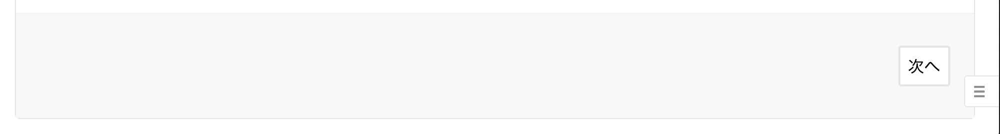
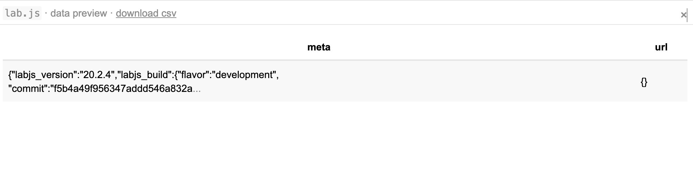

# Tips

lab.jsでオンライン実験・調査を作成する際に有用な情報をこちらにまとめます。

## 実際の実験に向けた準備
ここまでで紹介したオンライン実験とオンライン調査では，課題や尺度の作成のみを扱っていました。実際に実験や調査を実施しようとする場合には，以下の要素を追加する必要があるでしょう。

 * 事前説明
    * 実験・調査の概要，所要時間，リスクと利益などに関する事前説明文
 * インフォームドコンセントの取得
    * 事前説明を読んでもらった後にインフォームドコンセントを取得する
 * 教示
    * 実験・調査で参加者がどのように振る舞うのかを説明する
 * 終了画面
    * 終了画面で実験・調査後にウィンドウを閉じるようメッセージを表示したり，クラウドソーシングなどを利用した場合は確認コードなどの表示

教示は説明文の作成と同様に「Page HTML」を利用すれば作成できるでしょう。教示には必要に応じて画像（image）を追加するとわかりやすいでしょう。


事前説明・インフォームドコンセントの取得については以下のページをご覧ください。

[事前説明とインフォームドコンセントの取得](https://labjs.yucis.net/43061891302c4916b35fad35357891ff)


```note
#### オンライン実験と教示
オンライン実験を行う場合，教示は実験室実験よりも丁寧に行う方がよいでしょう。オンライン実験では，実験室実験と異なり，口頭での追加説明や質問受け付けができないため，画面上の教示のみで参加者に行ってもらいたい行動を十分に理解してもらう必要があるためです。そのため，教示は文章だけでなく画像や動画を用いるとよいでしょう。また，教示以外の工夫として練習試行の導入も有効です。
```

## データの前処理

## コンソールによるエラーの確認方法
うまく動かない場合には，どのようなエラーが生じているのかを調べる必要があります。デベロッパーツールを利用すると，どのようなエラーが生じているのを知ることができます。ブラウザによって起動方法が異なります。

 * Google Chromeの場合
    * 右クリックから「検証」を選ぶとデペロッパーツールが起動します
    * デペロッパーツールのタブから「console」を選ぶとJavaScriptコンソールが立ち上がります
    * もし，JavaScriptのエラーが起きている場合にはコンソールにエラーの内容が表示されます

## lab.js Builderによる変数の確認
lab.js Builderでの実験・調査の動作テスト中はデータを途中で確認することができます。テスト動作中の右下にあるボタン（Ξ）をクリックすると，現在のデータが表示されます。




以下のように現在までのデータが表示されるので，意図したような変数の値になっていない場合などは，こちらも確認してみるとよいでしょう。
