# lab.jsでオンライン実験を行う方法
lab.jsを使ってオンライン実験を行う場合は，サーバーを用意し，オンライン実験の実行とデータ保存するホスティングが必要になります。以下のようなやり方が可能です。それぞれのやり方を解説しているページがある場合は紹介しておきます。

 * Open lab（簡単，安価，オススメ）
    * 参考：[オンライン実験（Open Lab編）](https://www.notion.so/Open-Lab-5aadb17cffef4e97ada432091fa86f37)
 * サーバー（少しだけ難しい？，安価）
    * 参考：[オンライン実験（サーバー編）](https://www.notion.so/c465d5abf3c149ffb490d6d2fd7f22a5)
 * JATOS（導入は難しいが，多機能）
    *  参考：[オンライン実験（JATOS編）](https://www.notion.so/JATOS-bcd287f2250249aebd99b73ec39f02de)
 * Qualtricsなどと連携（難易度や費用は連携ツールに依存）
    * 参考：[lab.js公式ドキュメントのQualtiricsとの連携方法の紹介]https://labjs.readthedocs.io/en/latest/learn/deploy/3a-qualtrics.html

この中から，本TWSではOpen labについて紹介します。基本的には[オンライン実験（Open Lab編）](https://www.notion.so/Open-Lab-5aadb17cffef4e97ada432091fa86f37)と同じですが，[フランカー課題](./1_flanker.html)をオンライン実験にしてみます。

## Open labでのオンライン実験

### Open labとは

　Open labとはlab.js Buliderと連携することで，オンライン実験を簡単・安全に実施するためのホスティングサービスです。Open labがサーバーを提供してくれているので，実験者はlab.js Buliderで作成した実験をOpen labにアップロードするだけで，セキュリティが確保された環境でオンライン実験を実施することができます。しかも，lab.js Bulider自体にOpen Labとの連携機能が含まれており，簡単にアップロードが可能です。

[Open lab](https://open-lab.online/)

### 費用

費用についてはプランごとに以下のようになっています(https://open-lab.online/researcher/pricingより引用)。Freeプランでも1つのオンライン実験を走らせることができます。

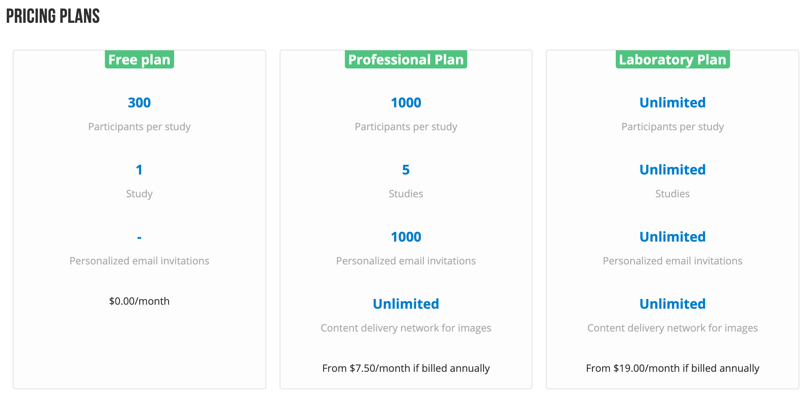

### Open labの使い方

#### Open labのアカウントの作成

まず，Open labのアカウントを作成してください。

 1. [Open lab](https://open-lab.online/)のTopページの右上にある「FOR RESEARCHERS」をクリック
 2. 「SIGN UP」をクリック，必要な情報（メールアドレスとパスワード）を入れてアカウントを作成してください

### lab.js BuliderからOpen lab用にアップロード

　オンライン実験を行いたい課題（TASKS）をlab.js BuliderからOpen labにアップロードします。フランカー課題をアップロードしてみます。

1. lab.js Builderのフロッピーマークの横の▼をクリックし，開いたメニューの中から「Upload to Open Lab」を選んでください
 
   

 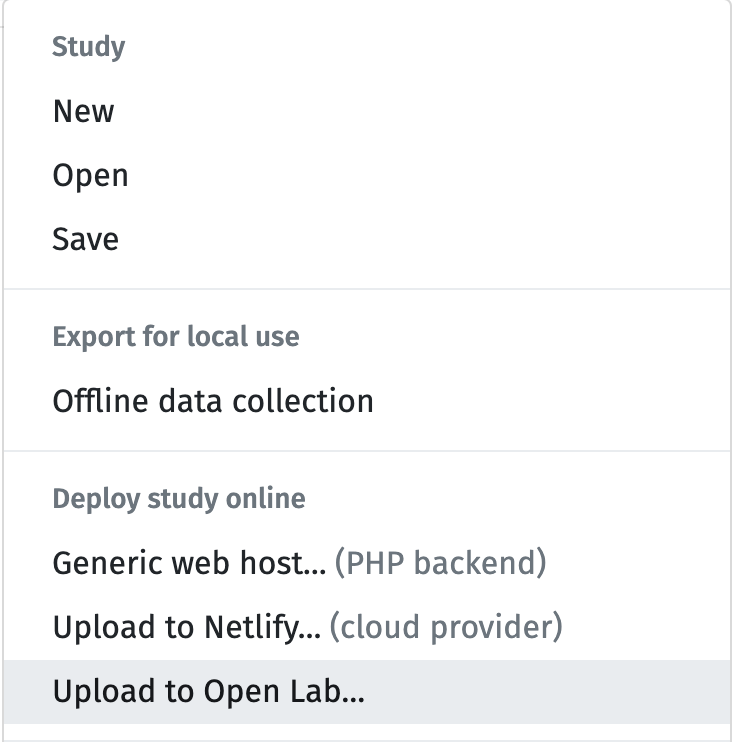

2. そうすると以下のようなウィンドウが表示されるので「Upload」をクリックし，しばらく待ちます（30秒程度ですが，もっと待つ場合があるかもしれません）。

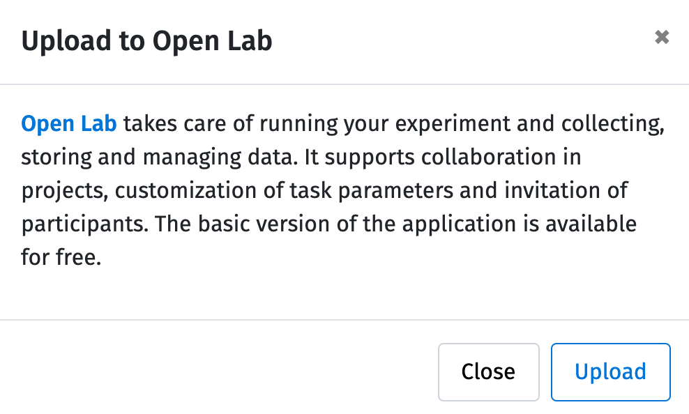

3. 「Manage study on Open Lab」と表示が変わるので，「Manage study on Open Lab」をクリックしてください

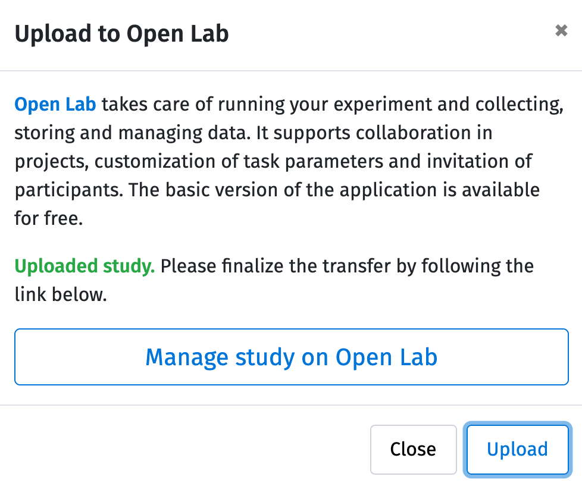

4. クリックするとOpen Labに移動します。そして，先ほどアップロードした実験の概要を入力する画面（以下の画像）が表示されます。

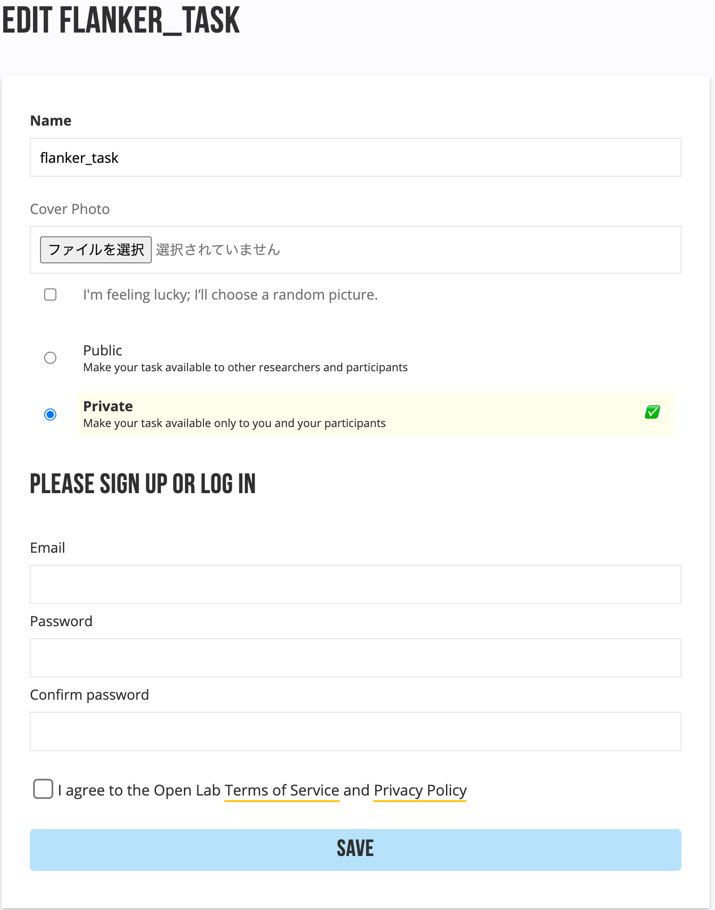

5. Nameには英語で実験名を入力します（ここでは「flanker_task」としました）
    * 実験名を日本語にした場合にうまく動作しなかったので，**実験名は必ず英語にしてください**
6. Cover Photoは表紙に画像をいれた場合に設定してください（設定しなくてもOK）
    * 「I'm feeling lucky; I’ll choose a random picture.」を選ぶとランダムな画像が設定されます
7. 公開に関する設定を行いますが，「Private」にします
    * Public：Open labのサイトに掲載され，本当に誰でも実験を行えます
    * Private：自分と参加者のみが実験を行うことができます（招待された人のみ）
8. ここまで入力できたら，アカウント名とパスワードを入れて，「I agree to the Open Lab Terms of Service and Privacy Policy」にチェックを入れ，「SAVE」をクリックしてください
9. ページ上部に「Successfully updated」と表示されれば，無事にOpen Labに実験をアップロードできました（Try the task - >をクリックすると動作確認もできますが，ここでは後で行います）

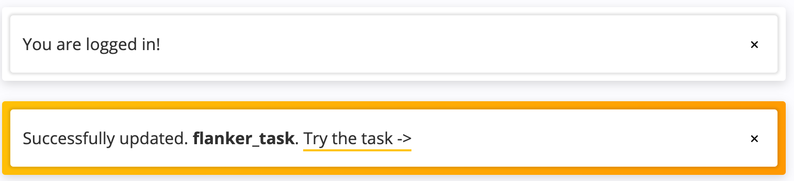

10. 実験の詳細を設定する画面が表示されますが，必要な部分があれば記入してください。特になければ，そのまま「SAVE」をクリックしてください
11. これでlab.js BuilderからOpen Labへのアップロードは完了です

### 動作確認

　では，アップロードした課題の動作確認を行いましょう。アップロードした自分の課題は「TASKS」に入っているので，画面左上の「TASKS」をクリックして移動してください。

以下のような画面になっているはずです（作成者は4つの実験を登録していたので4つ表示されていますが，おそらくフランカー課題1つだけが表示されているはずです）。アップロードした課題の再生マーク（▶）をクリックして動作確認をしておきましょう。

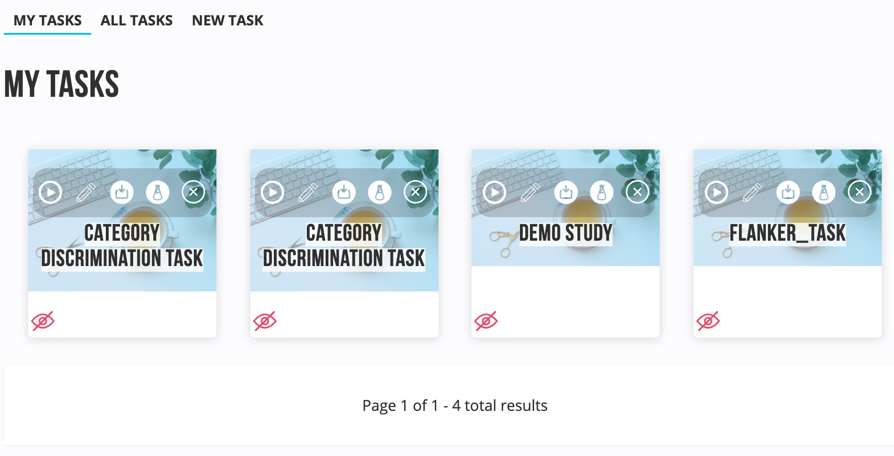

### オンライン実験の構成（Studyの作成）

　Open Labでは，lab.jsで作成した課題（TASK）を複数まとめたStudyという単位で参加者を募集します。今回は，フランカー課題が1つ含まれた実験（Study）を構成してみます。

1. Open labの上部メニューから「STUDIES」を選ぶと，以下のようなSTUDYの設定画面が表示されるので，必要事項を記入してください。

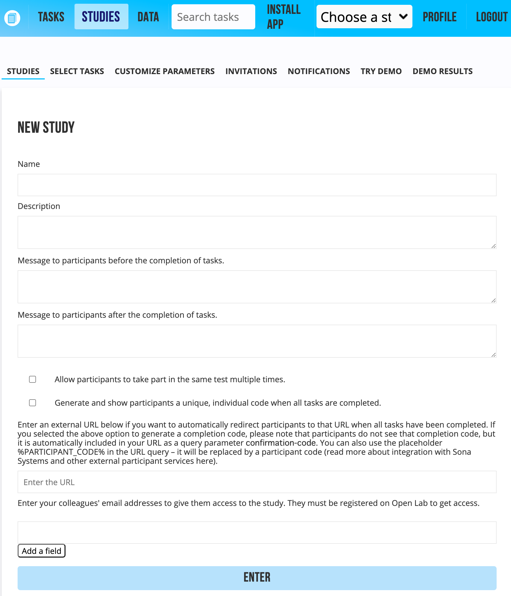

それぞれの内容は以下の通りです。

* Name
    * 実験名（URLになるのでここだけは**半角英数字推奨**）
* Description
    * 概要
* Message to participants before the completion of tasks
    * 実施前に参加者に表示するメッセージ
* Message to participants after the completion of tasks
    * 実施後に参加者に表示するメッセージ
* Allow participants to take part in the same test multiple times.
    * 同じ参加者に複数回の参加を許可する場合はチェック
* Generate and show participants a unique, individual code when all tasks are completed.
    * 参加者ごとに独自のコードを生成する場合はチェック
* Enter an external URL〜
    * 他のツールとの連携用
* Enter your colleagues' email addresses
    * 共同研究者のメールアドレスを登録すると，その人もこの実験にアクセス可能になる

2. 入力後， 「Enter」を押してください。そうすると，以下のような「YOUR STUDIES」に先ほど作成した実験が表示されます。

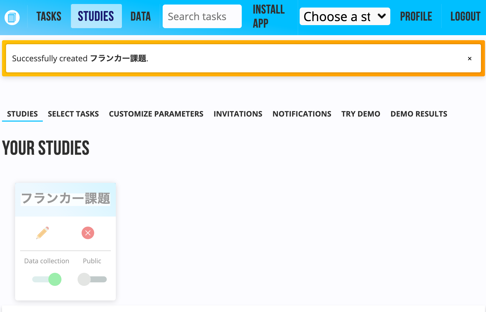

3. このまま，実験に入れる課題を選びたいところですが，その前にStudyをActivateする必要があります。よく見ると，この時点では作成した実験が薄い表示になっています。作成した実験の実験名（位置に注意）にカーソルを当てると，カーソルが変化するので，そこをクリックしてActivateしましょう。うまくいくと画面上部に「実験名 is now active」と表示されます。少しわかりにくいので注意しましょう。

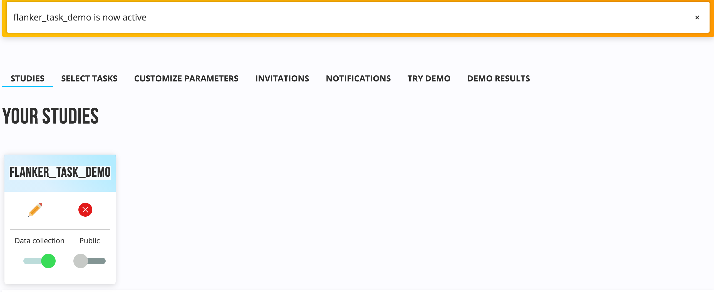

5. 続いて，activeにした実験に入れる課題を選びます。SELECT TASKSをクリックしてください。SELECT TASKをクリックすると，実験に追加できる課題が表示されます。自分で作成した課題を使うので，My tasksに表示されている「AVAILABLE TASK」から先ほどアップロードした課題（FLANKER_TASK）を追加してください。課題の＋ボタンをクリックすることで追加できます。

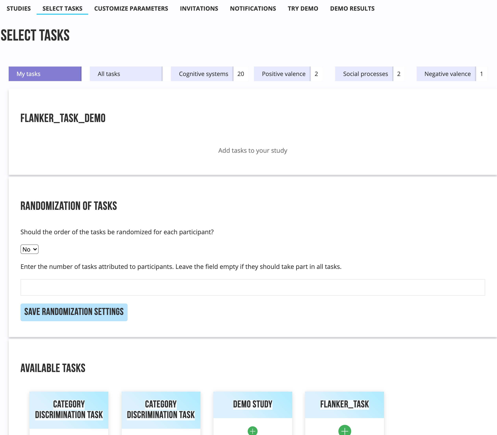

6. 追加すると以下のようになります。

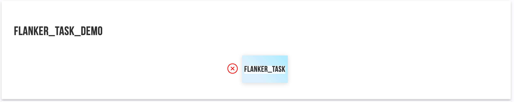

7. 「TRY DEMO」をクリックするとテストすることができます。さらに，テスト結果も得られるので，募集前に一度やってみて，テスト結果を使って分析ができるかを確認すると良いでしょう。

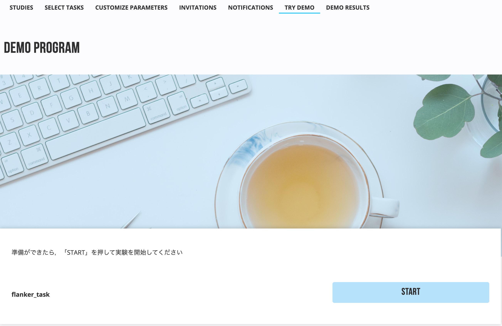

　ちなみに，YOUR STUDIESで表示されているスイッチはPrivateとPublicの切替スイッチとデータ収集（Data collection）のON/OFFスイッチです。募集前や募集終了後にオンライン実験を実施されたくない場合にデータ収集のON/OFFスイッチをオフにしましょう。

### 参加者を実験に招待

　では，実験参加者を実験に招待してみましょう。招待は，STUDIESの中にある「INVITATIONS」から行うことができます。「INVITATIONS」をクリックすると以下のような画面が表示され，4つの方法で参加者を実験に招待することができます。好きな設定のリンクをコピーして実験参加者に伝えることで，オンライン実験に参加してもらえます。

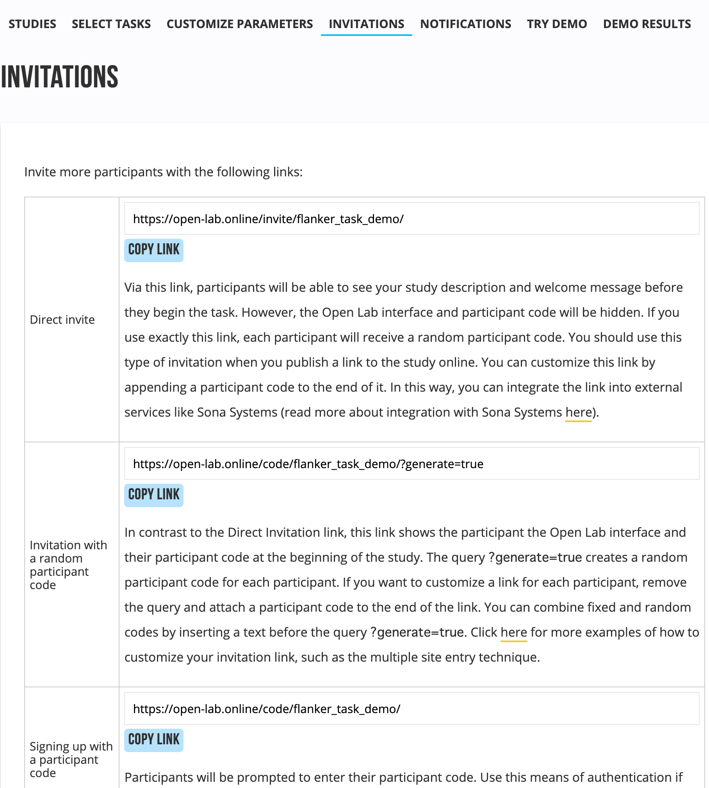     

それぞれの招待方法は以下のようになっています。

 1. Direct invite
    * ランダムな参加者番号を生成し表示せずに招待
 1. Invitation with a random participant code	
    * ランダムな参加者番号を生成し表示して招待
 1. Signing up with a participant code
    * 参加者に参加者番号を入力してしてもらう招待
 1. Signing up with an email
    * 参加者にメールアドレスとパスワードで登録してもらう招待
 1. Signing up via an external account	
    * 参加者にGoogleかGithubのアカウントで登録してもらう招待

　普通のオンライン実験では，1番目の招待でよいでしょう。他の4つは目的に合わせて利用してください。例えば，縦断調査で同じ参加者に何回も参加してもらう場合には3〜5のいずれかになるでしょう。

　気をつけるべき点として，参加者に実験開始画面で「ENTER」ボタンをクリックしてもらわないと実験が開始しません。課題の「実施前に参加者に表示するメッセージ」で「ENTER」ボタンを押すよう教示する必要があります。

### 実験データ

　オンライン実験の実験データは，DATAに以下のように参加者ごとに格納されています。

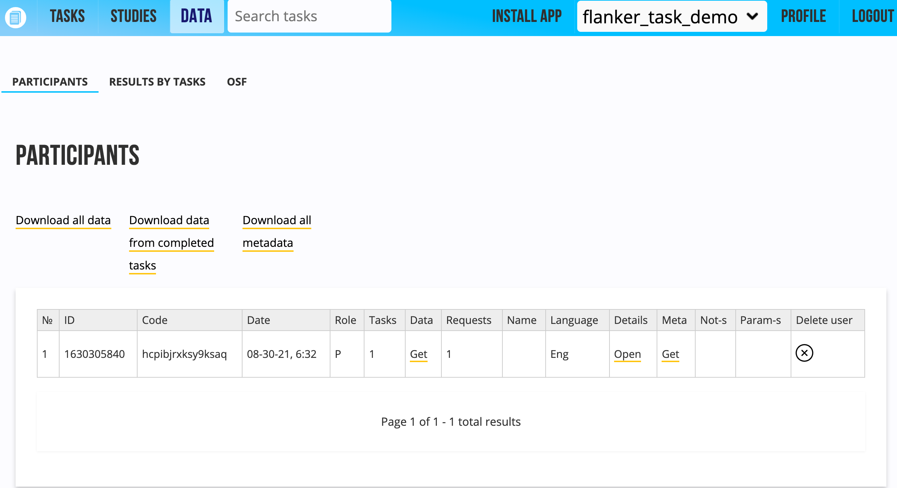

　データは以下の3つの方式から選んで保存できます。データはcsv形式となります。

 1. 全データをダウンロード（Download all data）
 2. 課題完了したデータのみダウンロード（Download data of completed tasks）
 3. 全メタデータをダウンロード（Download all meta data）

### デモ
Open labにアップロードしたオンライン実験は以下からお試しいただけます。

[https://open-lab.online/invite/flanker_task_demo](https://open-lab.online/invite/flanker_task_demo/)