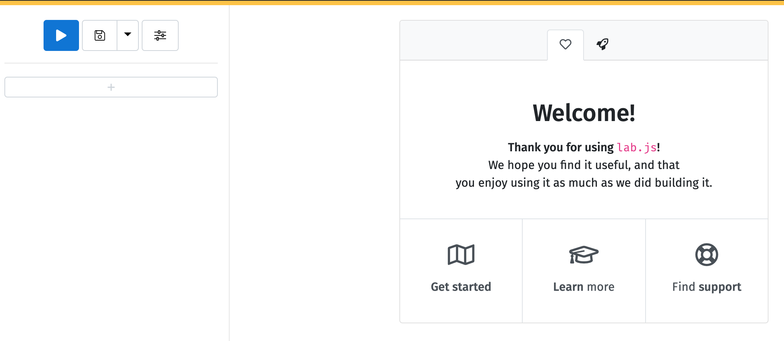
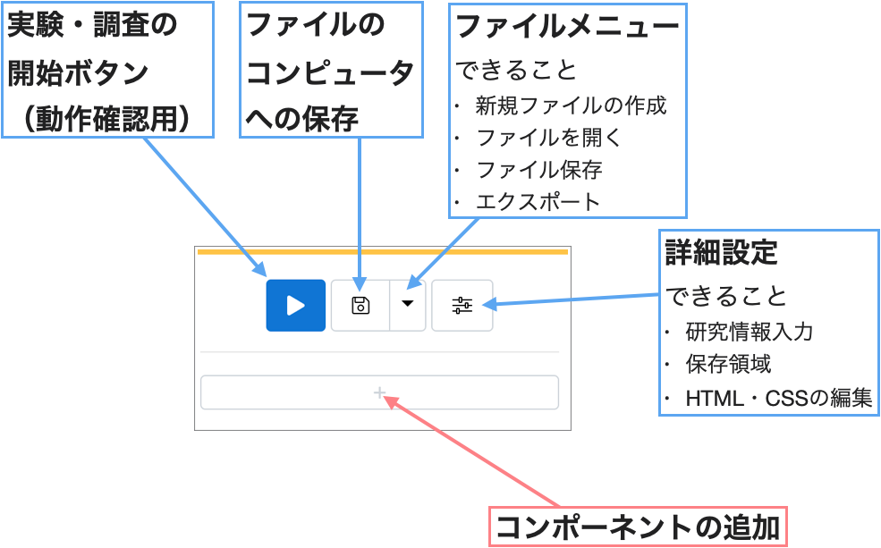

# はじめに：lab.jsとは

## lab.jsとは

　lab.jsは心理学実験・調査を実施するためのJavaScriptライブラリです。JavaScriptライブラリとはJavaScriptというプログラミング言語において利用できる様々な関数の集合です。lab.jsを利用することで，心理学実験・調査に必要な画面設計や時間制御，反応取得を（比較的）簡単に行うことができます。

### lab.js Builderとは

　lab.jsはJavaScriptライブラリであるため，lab.jsによる実験・調査の作成にはコードを書くこと（プログラミング）が必要です。しかし，lab.jsをGUI（Graphical User Interface; グラフィカルユーザーインターフェース）で作成するウェブアプリケーションとして，lab.js Builderが提供されています。GUIとは，名の通りに視覚的に情報が表示され，マウスなどによって直感的に操作可能なインターフェースです。lab.js BuilderはPsychoPyでのBuilderと同様のものです。lab.js Builderを利用することで視覚的に情報を確認しながら，マウス操作などでlab.jsによる実験・調査を作成することができます。

　ウェブアプリケーションとは，インターネットブラウザ（Edge, Chrome, Safariなど）で利用できるアプリケーションを指します。ウェブアプリケーションは，コンピュータにソフトウェアをインストールすることなく，ブラウザで利用できるため，異なる環境や機器でも同じように利用できます。

**図1. lab.js Builderの画面**

### lab.jsの仕組み

　lab.jsはJavaScriptライブラリなので，JavaScriptの機能によって実験・調査を実施しています。JavaScriptの働きの1つにHTMLやCSSを書き換えるというものがあり，これを利用しています。HTMLやCSSというのは，ウェブページの内容や見た目を制御する言語(マークアップ言語)です。皆さんが普段閲覧しているウェブページの多くはHTMLやCSSによって構築されています。この関係をまとめたものが以下の図です。

**図2. lab.jsの仕組み**

　JavaScript（含むlab.js）によって，ウェブページを動的に書き換えることで実験・調査を実施します。それぞれの言語の役割は以下のようになっています。

- HTML：ウェブページの内容，レイアウト，見た目を制御
- CSS：ウェブページのレイアウトや見た目をHTMLよりも細かく制御
- JavaScript（lab.js）：HTMLやCSSを制御（書き換える）

　例えば，「画面中央に文字を出して，10秒経ったら消える」という動作を行う場合は以下の流れで実現しています。

1. 中央に文字（'Hello, world!'）を配置したウェブページ（HTML, CSS）を作成
2. 1.のページの表示開始時点からの経過時間を計測（JavaScript）
3. 経過時間が10秒に達したら，ウェブページを書き換え，中央の文字を消す（JavaScript）

## はじめてのlab.js Builder

### lab.js Builderの利用方法

　lab.js Buliderは以下のURLをクリックしてください。

[lab.js - online research made easy](https://lab.js.org/)

　このページは今後も使うのでブックマークしておきましょう。次にlab.js Buliderを起動します。↑のページの右上のあるメニューから「Builder」をクリックしてください。

### lab.js Builderの初期画面

　lab.js Builderが立ち上がると，真ん中の「Welcome」メッセージが表示されています。ここから，公式のチュートリアルや実験例にアクセスすることもできます（チュートリアルは英語の動画ですが，一部，英語字幕を表示できます）。

　左のサイドバーに注目してください。このサイドバーが重要です。このサイドバーにある各ボタンによって，調査・実験開始，調査・実験の保存，過去の保存したファイルの読み込み，実施のためのエクスポート，詳細設定，コンポーネントの追加を行えます。以下の図を参考にしてください。

　「コンポーネントの追加」を赤色で強調していますが，この「＋」ボタンでコンポーネント（調査・実験の要素・パーツ）を追加し，構成していくことで実験・調査を作成していきます。

### どのようなコンポーネントがあるのか

　大きく分けてコンポーネントには画面構成用コンポーネントと工程構成用コンポーネントの2種類存在します。

 1. 画面構成用コンポーネント（Canvas ScreenやHTML pageなど）
 2. 工程構成用コンポーネント（LoopやSequenceなど）

画面構成用コンポーネントで実験・調査の画面を作成し，それらのコンポーネントの実施順やループを工程構成用コンポーネントで制御することで実験・調査を構成します。

よく使うコンポーネントの特徴は以下の通りです。

- Canvas Screen：Canvasを用いて画面を構成（時間精度が高い）
- HTML Page：HTMLを用いて質問項目などの画面を構成
- Sequence：複数のコンポーネントをまとめて1つのグループにする
- Loop：含まれたコンポーネントを繰り返す

#### CanvasとHTMLのどちらで画面を構成するべきか
