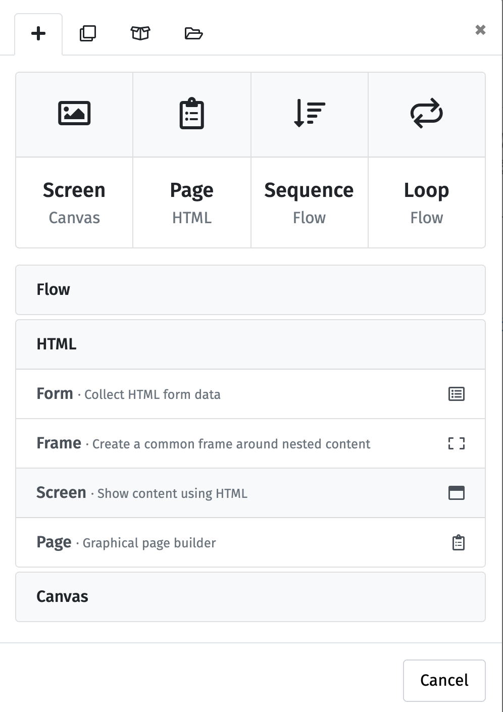
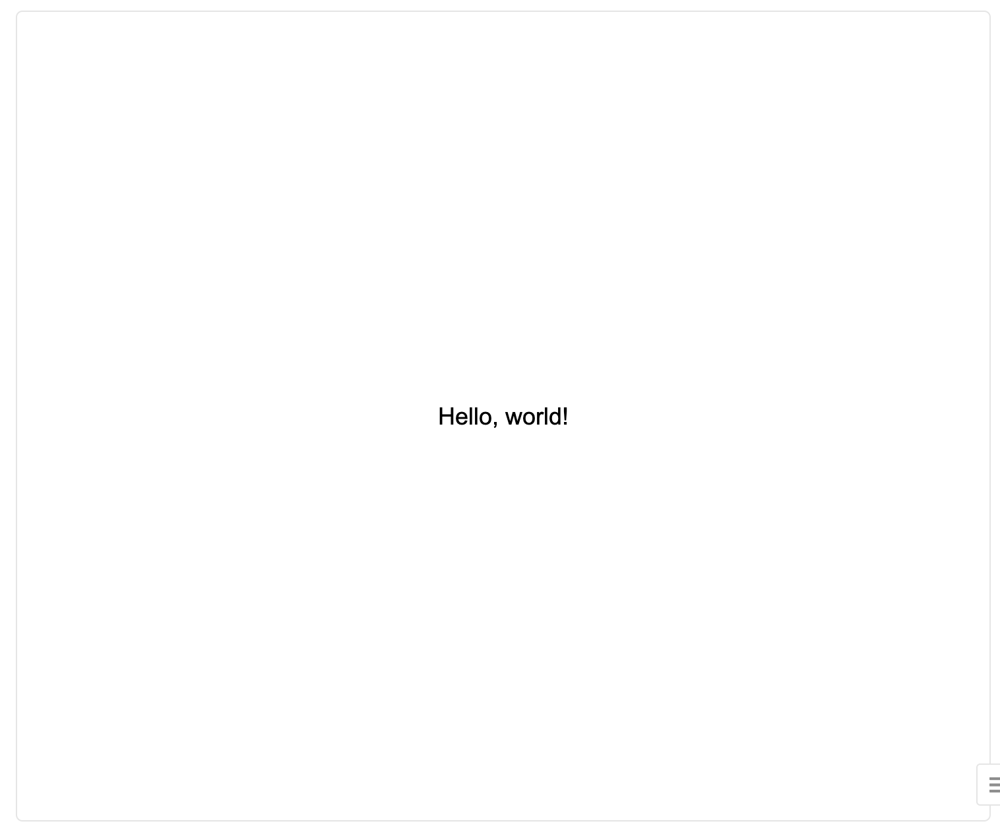
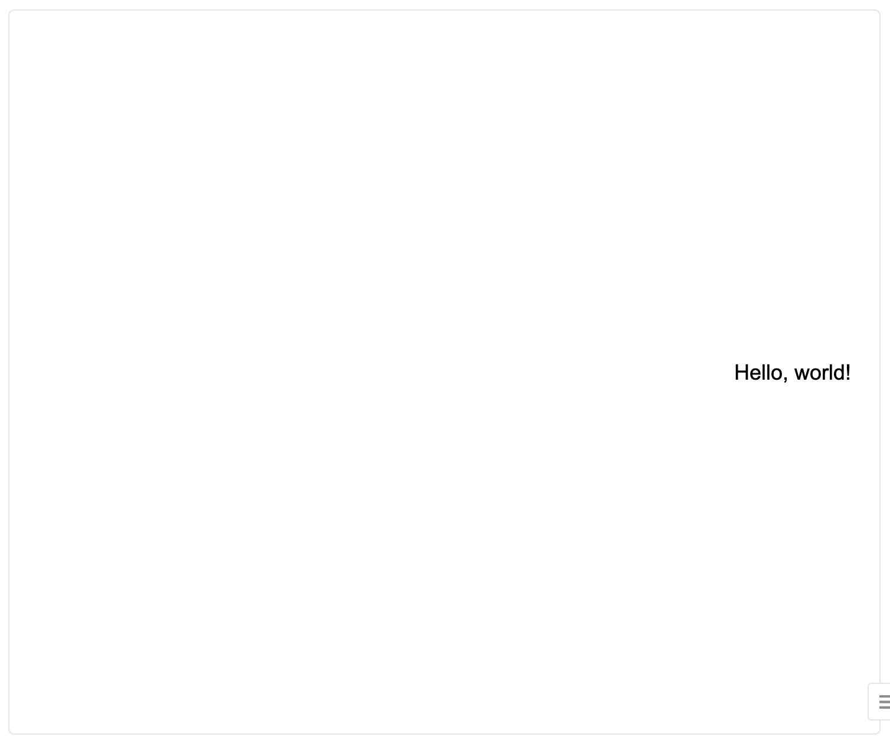

# Hello, wolrd（HTML screen）
Canvas screenで行った文字の表示はHTML screenでも行うことができます。なお，基本的にはCanvas screenで作成した画面をHTML screenで作成する方法を紹介するので，呈示時間の制御などのCanvas screenと共通する内容は割愛します。

## 文字の表示
サイドバーの「＋」から「HTML Screen」を追加してください。デフォルトではこのコンポーネントは表示されないため，以下の画像のようにメニュー下部のHTMLをクリックし，メニューを展開して選択してください。



HTML ScreenはHTMLで画面構成するためのコンポーネントです。HTMLベースの画面構成用コンポーネントはいくつかありますが，HTML Screenは素のHTMLを自分で記述して画面構成します。HTML Pageというテキストボックスなどの質問項目の作成に適したパーツが事前に用意されたものも便利です（ただし，レイアウトの柔軟な変更はしにくい）。


では，文字を表示するHTMLコードを記述します。「Content」に以下のようなHTMLのコードを記述してください。

```html
<!-- メインの部分を<main></main>の間に記述する。
なお，ここでは書いていないが<header></header>でヘッダー，
<footer></footer>でフッターも記述できる。 -->

<!-- lab.jsにデフォルトで用意されている水平方向の中央寄せ（content-horizontal-center）と
垂直方向の中央寄せ（content-vertical-center）をclassで指定すると，
<main></main>内で記述した部分が水平垂直方向に中央寄せになる。 -->

<main class = "content-horizontal-center content-vertical-center">
  <div>
    <p>
      Hello, world!
    </p>
  </div>
</main>
```

これで，以下のように，画面中央に「Hello, wolrd!」という文字が表示されます。必要に応じて，[Canvas Screenでの文字表示](./hello_world_canvas.md)を参考に呈示時間などを変更してみてください。





## HTML Screenでは何をやっているのか（省略可）
上記のコードで画面中央に「Hello, wolrd!」と表示される中身はどうなっているのかを少し説明します（HTMLの知識がある方や背景に関心のあまりない方は読み飛ばしてください）。

注意点として，lab.jsにはHTMLで画面を構成するためのレイアウトの指定や定義が既に行われているため，ここでの説明は一般的なHTMLでのページ構成とは少し異なる説明になります。

まず，lab.js BuilderでHTML Screenベースの画面を作成する場合，場面の領域をheader, main, footerの3つに分けて考えます。このうち，headerとfooterはメイン画面ではない上部と下部の領域となるため，省略される場合も多いでしょう。headerとfooterはWordをイメージしていただくとよいかもしれません。mainの部分がメイン画面になります（そのままですが）。

まず，どこからどこまでがメイン場面として画面レイアウトを構成するのかを定義します。`<main>`から始まり，`</main>`までの範囲がメイン画面であることを`<main></main>`のHTMLタグで記述します。`<`と`>`で囲まれた文字列はHTMLタグとして認識されるため，画面には表示されない点に注意してください。

しかし，今回は`<main>`ではなく，`<main class = "content-horizontal-center content-vertical-center">`と記述してます。ここでは`<main>`から`</main>`で囲まれた領域のレイアウトとして`content-horizontal-center`と`content-vertical-center`というclassを指定しています。classとは特定のレイアウトや見た目を予め任意のclass名で定義しておくことで，class名を与えることで，事前に定義したレイアウトに当該要素を変化させるものです。例えば，ファッションで「オフィスカジュアル」と言えば，どのような見た目かがわかるというイメージでしょうか。lab.jsで用意されている`content-horizontal-center`というclassを指定した場合，その要素は水平方向に中央寄せで表示されます。今回は，`content-horizontal-center`と`content-vertical-center`の2つ指定することで，水平方向と垂直方向に中央寄せ（つまり，画面中央寄せ）を実現しています。他のも色々なclassが用意されていますが，詳しくは[こちら](https://labjs.readthedocs.io/en/latest/learn/css/style.html)をご確認ください。

classをうまく利用することでレイアウトや見た目を簡単に制御することができます。例えば，以下のように書き替えると水平方向に右寄せ，垂直方向に中央寄せが実現できます。

```html
<main class = "content-horizontal-right content-vertical-center">
  <div>
    <p>
      Hello, world!
    </p>
  </div>
</main>
```



サイドバーの「設定」→「CSS」で自分で新たにclassを定義することも可能です。

`<div></div>`はグループ化するためのタグ`<p></p>`は段落タグになります。詳しくはHTMLに関する資料をご参照ください。

## 見た目の変更

HTMLでは文字サイズや色を比較的簡単に変更することができます。
例えば，以下のように小さい文字サイズから大きなサイズまで変更が可能です。

小さい字
```html
<main class = "content-horizontal-center content-vertical-center">
  <div>
    <!-- style = "font-size:○vh"でフォントサイズを変更する（vhは縦の画面サイズ(Y）を100vhとした時の割合でサイズ指定する方法。画面サイズと刺激の比が環境間で揃う） -->
    <p style = "font-size: 1vh;">
      Hello, world!
    </p>
  </div>
</main>
```

中くらいの字
```html
<main class = "content-horizontal-center content-vertical-center">
  <div>
    <!-- style = "font-size:○vh"でフォントサイズを変更する（vhは縦の画面サイズ(Y）を100vhとした時の割合でサイズ指定する方法。画面サイズと刺激の比が環境間で揃う） -->
    <p style = "font-size: 5vh;">
      Hello, world!
    </p>
  </div>
</main>
```

大きな字
```html
<main class = "content-horizontal-center content-vertical-center">
  <div>
    <!-- style = "font-size:○vh"でフォントサイズを変更する（vhは縦の画面サイズ(Y）を100vhとした時の割合でサイズ指定する方法。画面サイズと刺激の比が環境間で揃う） -->
    <p style = "font-size: 10vh;">
      Hello, world!
    </p>
  </div>
</main>
```

色を変えたい場合は以下のように変更が可能です。

色名で指定
```html
<main class = "content-horizontal-center content-vertical-center">
  <div>
    <!-- style = "color:○○;"で色を変更できる -->
    <p style = "color:tomato;">
      Hello, world!
    </p>
  </div>
</main>
```

RGBで指定
```html
<main class = "content-horizontal-center content-vertical-center">
  <div>
    <!-- style = "color:○○;"で色を変更できる -->
    <p style = "color: #0000ff;">
      Hello, world!
    </p>
  </div>
</main>
```

このように，HTML ScreenはHTMLとCSSでレイアウトや見た目を制御します。レイアウトや見た目を制御したい場合はlab.jsjやJavaScriptではなく，HTMLやCSSについて調べると解決することが多いでしょう。

## デモ＆ソース

ここページで取り上げた内容をまとめたlab.jsのデモとソースファイルは以下の通りです。

 * [デモ](./demo/hello_wordl_html_demo/index.html)
 * [ソース](./data/hello_world_html_demo.json)